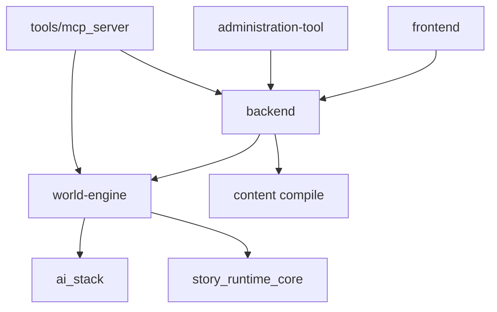

# Ecosystem Topology — Software Architecture (arc42, project-wide)

**System:** Ecosystem Topology · **Scope:** project-wide · **Status:** `internal`  
**Last reconciled to code:** `2026-06-23`

## 1. Introduction & Goals

World of Shadows is a multi-service narrative platform: player web app, admin app, Flask backend,
FastAPI play service, shared runtime library, AI stack, canonical YAML content, and MCP tooling.
This SAD explains how those deployables compose and which service owns which class of truth.

### 1.1 Quality goals

| Goal | Scenario |
| --- | --- |
| Clear authority | An engineer can name the commit owner for a live turn without reading ten ADRs |
| Stable boundaries | No feature adds a second runtime graph without an explicit governance decision |
| Traceable capabilities | Each capability row routes to exactly one component SAD |

### 1.2 Stakeholders

| Stakeholder | Concern |
| --- | --- |
| Runtime engineer | Service map and proxy paths |
| Platform engineer | Backend vs play service env alignment |
| Technical writer | Internal vs audience doc boundaries |

## 2. Constraints

- Play authority in world-engine ([world-engine SAD D1](../../components/world-engine/architecture.md#d1-runtime-authority-in-world-engine)).
- Backend transitional runtime is not production play host ([backend-runtime-classification](../../../technical/architecture/backend-runtime-classification.md)).
- GoC slice contracts stay under `docs/MVPs/MVP_VSL_And_GoC_Contracts/`.

## 3. Context & Scope

Authoritative: [UML ecosystem context](../../../../UML/Project/ecosystem-topology/components/c4-context.md)

### 3.1 In / out of scope

| In scope | Out of scope |
| --- | --- |
| Service responsibilities, URLs, proxy paths | Module-level Python layout inside each service |
| Capability catalog | Player marketing copy |

<!-- BEGIN BT-SEMANTIC-DEPTH:3 -->
### Evidence-grounded scope and authority

Whole-system topology, authority map and architecture archaeology for Better Tomorrow.

**Authority rule:** Current executable code and accepted decisions define present truth; Git and archived MVP material are evidence of evolution and intent, not automatic authority.

**Git/archaeology scope:** `backend`, `frontend`, `world-engine`, `ai_stack`, `content`, `tools/mcp_server`, `administration-tool`

| Context concern | Model | Boundary statement |
| --- | --- | --- |
| Players, operators and bounded systems with explicit authority | [Better Tomorrow - System Context](../../../../UML/Project/ecosystem-topology/context/system-context.md) | Current executable code and accepted decisions define present truth; Git and archived MVP material are evidence of evolution and intent, not automatic authority. |

Historical MVP and work-order material is classified evidence, not an authority source. Current code and accepted decisions win; conflicts remain explicit until a target decision is accepted.
<!-- END BT-SEMANTIC-DEPTH:3 -->

## 4. Solution Strategy

- Separate deployables per process/container; align secrets between backend and world-engine.
- Keep AI orchestration in `ai_stack` but commit only in world-engine.
- Treat `content/modules/` as authored truth compiled by backend, consumed by engine.
- Route all architecture questions through component SADs first, this SAD second.

## 5. Building Block View

| Layer | Location | Responsibility |
| --- | --- | --- |
| Player UI | `frontend/` | Public routes, play shell |
| Admin UI | `administration-tool/` | Operations UI via backend |
| Backend | `backend/` | REST, auth, persistence, compile, proxy |
| Play service | `world-engine/` | Live sessions, turns, commits |
| Shared models | `story_runtime_core/` | Interpretation contracts, adapters |
| AI stack | `ai_stack/` | Graph, RAG, capabilities, research |
| Content | `content/modules/` | YAML modules |
| MCP | `tools/mcp_server/` | Operator/dev tools |

<!-- BEGIN BT-SEMANTIC-DEPTH:5 -->
### Source-bound building-block catalog

Each block has one stated responsibility, an interaction or ownership contract, and a current source anchor. The list is individualized for this scope; it is not derived from a fixed diagram count.

| Block | Kind | Responsibility | Contract | Source |
| --- | --- | --- | --- | --- |
| Operator (`operator`) | `actor` | Inspect and govern the platform | Privileged audited operation | [`administration-tool/app.py`](../../../../administration-tool/app.py) |
| Player (`player`) | `actor` | Experience and influence a live dramatic scene | Authenticated semantic interaction | [`frontend/templates/session_shell.html`](../../../../frontend/templates/session_shell.html) |
| Current Code (`current_code`) | `artifact` | Show executable present structures | HEAD plus source anchors | [`README.md`](../../../../README.md) |
| Git History (`git_history`) | `artifact` | Show movement, replacement and hotspot chronology | Commit and rename evidence | [`.git`](../../../../.git) |
| Historical MVP Corpus (`archive`) | `artifact` | Preserve earlier goals, audits, snapshots and work orders | Non-authoritative read-only archaeology snapshot | [`docs/architecture/evidence/README.md`](../../evidence/README.md) |
| Target Architecture (`target`) | `artifact` | State the best coherent solution selected from evidence | Accepted decisions and implementable deltas | [`docs/architecture/project/ecosystem-topology/architecture.md`](architecture.md) |
| Architecture Reconciliation (`reconciliation`) | `component` | Classify claims and expose contradictions | confirmed, obsolete, conflicting or open | [`tools/architecture_assurance/model_catalog.json`](../../../../tools/architecture_assurance/model_catalog.json) |
| Authored Truth (`authored_truth`) | `container` | Supply experience identity and policy | Immutable bound module version | [`content/modules/god_of_carnage/module.yaml`](../../../../content/modules/god_of_carnage/module.yaml) |
| Identity and Platform (`identity`) | `container` | Authenticate users and serve platform data | Backend ownership | [`backend/app/api/v1/auth_routes.py`](../../../../backend/app/api/v1/auth_routes.py) |
| Live Runtime (`live_runtime`) | `container` | Coordinate and commit canonical turns | World-engine ownership | [`world-engine/world_engine/story_runtime/manager/runtime_manager.py`](../../../../world-engine/world_engine/story_runtime/manager/runtime_manager.py) |
| Play Proxy (`play_proxy`) | `container` | Bridge player requests to live authority | No local story commit | [`backend/app/services/game/game_service.py`](../../../../backend/app/services/game/game_service.py) |
| Proposal Runtime (`proposal_runtime`) | `container` | Interpret, retrieve, plan, realize and validate candidates | AI proposal only | [`ai_stack/langgraph/langgraph_runtime_executor.py`](../../../../ai_stack/langgraph/langgraph_runtime_executor.py) |
| Confirmed Current (`confirmed`) | `state` | Match current code and accepted decision | Live source anchors | [`docs/architecture/project/ecosystem-topology/evidence-matrix.md`](evidence-matrix.md) |
| Conflicting (`conflicting`) | `state` | Expose concurrent incompatible truths | Decision required | [`docs/architecture/project/ecosystem-topology/architecture.md`](architecture.md) |
| Obsolete (`obsolete`) | `state` | Explain superseded historical material | Replacement evidence | [`docs/architecture/project/ecosystem-topology/evidence-matrix.md`](evidence-matrix.md) |
| Open Target Question (`open`) | `state` | Preserve valuable intent not yet implemented | Explicit option and acceptance evidence | [`docs/architecture/project/ecosystem-topology/mechanism-catalog.md`](mechanism-catalog.md) |
| Unclassified Claim (`unclassified`) | `state` | Hold an archaeological assertion before verification | Source and date recorded | [`docs/architecture/project/ecosystem-topology/evidence-matrix.md`](evidence-matrix.md) |
| AI Stack (`ai`) | `system` | Propose dramatically informed outcomes | Proposal-only runtime | [`ai_stack/langgraph/langgraph_runtime_executor.py`](../../../../ai_stack/langgraph/langgraph_runtime_executor.py) |
| Administration Tool (`admin`) | `system` | Present governed operator workflows | Backend-delegated mutations | [`administration-tool/app.py`](../../../../administration-tool/app.py) |
| Backend (`backend`) | `system` | Own identity, community and control-plane truth | Flask API | [`backend/app/factory_app.py`](../../../../backend/app/factory_app.py) |
| Content Authority (`content`) | `system` | Own authored experience facts and policy | Versioned YAML modules | [`content/modules/god_of_carnage/module.yaml`](../../../../content/modules/god_of_carnage/module.yaml) |
| Frontend (`frontend`) | `system` | Present player interaction and transient UI state | Browser shell | [`frontend/app/__init__.py`](../../../../frontend/app/__init__.py) |
| MCP Server (`mcp`) | `system` | Expose bounded local automation capabilities | JSON-RPC adapter | [`tools/mcp_server/server.py`](../../../../tools/mcp_server/server.py) |
| World Engine (`world`) | `system` | Own live sessions and commit story truth | Story HTTP/WebSocket API | [`world-engine/world_engine/main.py`](../../../../world-engine/world_engine/main.py) |
<!-- END BT-SEMANTIC-DEPTH:5 -->

## 6. Runtime View

Typical player turn: browser → frontend → backend game routes → world-engine story API → ai_stack graph → validate/commit in engine → response chain back. See [turn-execution-canonical UML](../../../../UML/Project/turn-execution-canonical/README.md).

<!-- BEGIN BT-SEMANTIC-DEPTH:6 -->
### Dynamic viewpoint suite

| Runtime concern | Viewpoint | Model | Modeled interactions |
| --- | --- | --- | ---: |
| Whole-system player turn across all authority boundaries | `sequence` | [Better Tomorrow - Canonical Turn](../../../../UML/Project/ecosystem-topology/sequence/canonical-turn-sequence.md) | 6 |
| Historical claims become confirmed, obsolete, conflicting or open target options | `state` | [Better Tomorrow - Historical Claim Classification](../../../../UML/Project/ecosystem-topology/states/claim-classification.md) | 6 |
| Player experience, operator governance and automated inspection remain separated | `usecase` | [Better Tomorrow - Authority Use Cases](../../../../UML/Project/ecosystem-topology/usecases/authority-use-cases.md) | 4 |

The ordered sequence/activity relationships and state transitions are validated against the catalog. Generic arrows such as "evidence for boundary" are not accepted as runtime semantics.
<!-- END BT-SEMANTIC-DEPTH:6 -->

## 7. Deployment View

Run frontend, backend, administration-tool, and world-engine as separate processes. Use `docker-up.py` for local bootstrap. CORS must include frontend origins on backend.

<!-- BEGIN BT-SEMANTIC-DEPTH:7 -->
### Deployment and operational boundary evidence

This scope does not claim an independently deployable runtime. Its deployment effect is expressed through the owning systems and the following implementation roots:

- `backend`
- `frontend`
- `world-engine`
- `ai_stack`
- `content`
- `tools/mcp_server`
- `administration-tool`

A deployment boundary is not inferred from a directory. Process, store, transport and trust contracts must be named by a deployment view or delegated to an owning SAD.
<!-- END BT-SEMANTIC-DEPTH:7 -->

## 8. Crosscutting Concepts

- Ticket bridge: `PLAY_SERVICE_SHARED_SECRET` / `PLAY_SERVICE_SECRET` ([world-engine README](../../../../world-engine/README.md)).
- Internal API key optional hardening for join-context and termination endpoints.
- Writers-room is optional demo UI over backend APIs—not production truth.

<!-- BEGIN BT-SEMANTIC-DEPTH:8 -->
### Explicit interaction and dependency contracts

| From | To | Semantics | Contract | Evidence |
| --- | --- | --- | --- | --- |
| Historical MVP Corpus | Architecture Reconciliation | supplies historical claims | read-only dated provenance | Contract-only boundary |
| Current Code | Architecture Reconciliation | supplies present structure | source anchors | Contract-only boundary |
| Git History | Architecture Reconciliation | supplies evolution | commit/rename chronology | Contract-only boundary |
| Identity and Platform | Play Proxy | authorizes launch | player and run binding | [`backend/app/api/v1/game/player_turn_execution_and_flush.py`](../../../../backend/app/api/v1/game/player_turn_execution_and_flush.py) |
| Proposal Runtime | Live Runtime | returns candidate | validation evidence and no commit | [`world-engine/world_engine/story_runtime/narrative_commit_resolution.py`](../../../../world-engine/world_engine/story_runtime/narrative_commit_resolution.py) |
| Play Proxy | Live Runtime | forwards command | signed ticket | [`backend/app/services/game/game_service.py`](../../../../backend/app/services/game/game_service.py) |
| Architecture Reconciliation | Target Architecture | justifies target options | accepted decision and delta | Contract-only boundary |
| Live Runtime | Proposal Runtime | requests candidate | proposal-only call | [`world-engine/world_engine/story_runtime/governed_runtime_adapters.py`](../../../../world-engine/world_engine/story_runtime/governed_runtime_adapters.py) |
| Authored Truth | Live Runtime | bounds session | immutable module version | [`world-engine/world_engine/content/backend_loader.py`](../../../../world-engine/world_engine/content/backend_loader.py) |
<!-- END BT-SEMANTIC-DEPTH:8 -->

## 9. Architecture Decisions

| ID | Title | Status | Migrated from |
| --- | --- | --- | --- |
| D1 | Layered multi-service map | Accepted | architecture-overview consolidation |

### D1: Layered multi-service map

**Status:** Accepted
**Origin:** architecture-overview consolidation (retired 2026-06-23)

**Context.** Service boundaries were scattered across contract stubs; operators needed one canonical map tying backend, world-engine, ai-stack, and frontend responsibilities for onboarding and incident response.

**Decision.** The table in §5 is the canonical service map; legacy `current_service_boundaries` contract stubs were retired in favor of this SAD.

**Consequences.** Incident runbooks and onboarding cite §5; contract stubs must not be reintroduced as parallel truth.

**Evidence.** [`docs/technical/architecture/service-boundaries.md`](../../../technical/architecture/service-boundaries.md).

### D2: `docker-up.py` as Complete Local Bootstrap

**Status:** 
**Origin:** ADR-0030 (retired 2026-06-23)

**Context.** `docker-up.py` is the canonical operator entry point for a local World of Shadows stack. The current implementation is no longer a thin wrapper around `docker compose up`; it is responsible for preparing a usable runtime before Compose starts.

Three implementation realities are important:

1. Platform secrets are generated on the host and persisted in the repository-root `.env`.
2. The Docker stack now includes Redis as shared runtime-governance storage because backend runs multiple Gunicorn workers.
3. Langfuse is runtime-configured in backend settings; `docker-up.py` only imports `LANGFUSE_*` credentials when they are explicitly present in `.env`.
4. Local Redis and production Redis have different security postures: local app Redis remains internal with no host port, while production must enforce separate app/Langfuse Redis instances, passwords, ACL users, and TLS.

This ADR replaces older assumptions such as:

- "docker-up only starts containers"
- "Langfuse is enabled through `LANGFUSE_ENABLED` in `.env`"
- "governance runtime state can safely live in process memory in Docker"

**Decision.** ### 1. `docker-up.py` owns first-run environment materialization

Before any `up`, `build`, or `restart` flow, `docker-up.py` ensures the repository-root `.env` exists and contains:

- generated stable platform secrets:
  - `SECRET_KEY`
  - `JWT_SECRET_KEY`
  - `SECRETS_KEK`
  - `PLAY_SERVICE_SHARED_SECRET`
  - `PLAY_SERVICE_INTERNAL_API_KEY`
  - `FRONTEND_SECRET_KEY`
  - `INTERNAL_RUNTIME_CONFIG_TOKEN`
- defaulted runtime URLs:
  - `OPENAI_BASE_URL`
  - `OPENROUTER_BASE_URL`
  - `OLLAMA_BASE_URL`
  - `ANTHROPIC_BASE_URL`
  - `ANTHROPIC_VERSION`
  - `REDIS_URL`
- empty-but-present provider credential slots:
  - `OPENAI_API_KEY`
  - `OPENROUTER_API_KEY`
  - `ANTHROPIC_API_KEY`
  - `LANGFUSE_PUBLIC_KEY`
  - `LANGFUSE_SECRET_KEY`

This is the authoritative first-run behavior. Operators are not expected to hand-author a minimal `.env` before the stack can start.

### 2. Docker bootstrap includes a shared Redis runtime-governance store

The local Compose stack must start:

- `backend`
- `frontend`
- `administration-tool`
- `play-service`
- `redis`

Redis is not optional in the standard Docker path because MVP4 runtime governance now persists:

- token budget state
- truthful cost summaries
- evaluation annotations and baselines
- recent turn quality signals
- active override indexes

Without Redis, each backend worker would keep its own in-memory view, which is not acceptable for Docker-operated observability and governance.

### 3. Backend initialization remains the source of governed runtime truth

`docker-up.py up` must:

1. ensure `.env`
2. run `docker compose up -d --build`
3. wait for backend health
4. create the bootstrap admin user
5. optionally import Langfuse config into backend settings

`docker-up.py` does not become the long-term owner of runtime settings. It only helps seed them.

### 4. Langfuse bootstrap is optional import, not env-flag activation

Current behavior is:

- if both `LANGFUSE_PUBLIC_KEY` and `LANGFUSE_SECRET_KEY` are absent in `.env`, `docker-up.py` leaves backend observability settings unchanged
- if both are present, `docker-up.py` calls the backend initialization endpoint and imports the Langfuse configuration
- if only one key is present, bootstrap fails loudly

This means Docker bootstrap supports two valid operator flows:

1. Configure Langfuse later in backend/admin settings
2. Preseed Langfuse from `.env` during bootstrap

It does not rely on a legacy `LANGFUSE_ENABLED` environment toggle.

### 5. Failure must remain explicit

The current exit-code contract stays in force for `up`:

- `0` success
- `1` Docker/Compose failure
- `2` backend migration/bootstrap failure
- `3` admin-user creation failure
- `4` Langfuse initialization failure when credentials were supplied
- `5` backend health check failure
- `6` `.env` validation/materialization failure

### 6. Production secret stores must not break local bootstrap

Production deployments should source secrets from a dedicated secret store with rotation, audit logging, and separated access. That production store is a deployment responsibility outside this local helper.

`docker-up.py` must remain able to create or repair a local repository-root `.env` without contacting a central secret manager. Any future production integration must inject environment variables before the services start, or wrap deployment-specific infrastructure outside `docker-up.py`, while preserving the existing `init-env`, `up`, `build`, and `restart` behavior for local Compose.

### 7. Production Redis hardening is a first-class bootstrap path

`docker-up.py init-production-redis` must materialize the production Redis contract without manual file authoring:

- `APP_REDIS_USERNAME`, `APP_REDIS_PASSWORD`, `APP_REDIS_URL`, and TLS CA path for backend runtime governance Redis
- `LANGFUSE_REDIS_USERNAME`, `LANGFUSE_REDIS_PASSWORD`, `LANGFUSE_REDIS_CONNECTION_STRING`, TLS paths, and CA validation for Langfuse Redis
- ignored local ACL files under `.docker/redis-production/` with `default` disabled
- ignored local TLS certificates for the separate app Redis and Langfuse Redis services

`docker-compose.redis-production.yml` is layered only when `--production-redis`, `WOS_DOCKER_PRODUCTION_REDIS=1`, or `production-redis-up` is used. The override keeps Redis services internal, switches Redis to TLS-only, and injects the hardened app Redis URL into backend as `REDIS_URL`.

Validation is explicit: `python docker-up.py validate-production-redis` fails if URLs are not `rediss://`, TLS flags are false, ACL users/passwords are missing or shared, app and Langfuse Redis hosts are not separate, or generated ACL/cert assets are missing.

**Consequences.** ### Positive

- Local operators get a runnable stack from one command path.
- The generated `.env` and Redis service reflect the actual current runtime architecture.
- MVP4 governance data stays coherent across backend workers in Docker.
- Langfuse setup supports both env-preseed and backend-managed configuration.
- Production operators get a repeatable Redis hardening path instead of hand-editing passwords, ACL files, and TLS paths.

### Negative / risks

- The repository-root `.env` becomes part of normal local operations and must be preserved carefully.
- Redis is now a standard local dependency for Docker-based governance truth.
- Older docs or habits that assume env-only observability control are incorrect and must not be followed.

**Implementation status.** **Implemented and tested.**

- `docker-up.py` is the canonical operator entry point; it materializes `.env` before any Compose operation.
- All required secrets (`SECRET_KEY`, `JWT_SECRET_KEY`, `SECRETS_KEK`, `PLAY_SERVICE_SHARED_SECRET`, `PLAY_SERVICE_INTERNAL_API_KEY`, `FRONTEND_SECRET_KEY`, `INTERNAL_RUNTIME_CONFIG_TOKEN`) and runtime URLs (`REDIS_URL`, etc.) are generated on first run.
- `docker-compose.yml` includes `redis` service; Redis is not optional in the standard Docker path.
- Langfuse bootstrap is optional import (credentials from `.env` only if both keys present); not governed by legacy `LANGFUSE_ENABLED` flag.
- Production secret stores are explicitly out of scope for `docker-up.py`; the helper remains the local `.env` bootstrap path and must not require Vault/KMS/cloud-secret access.
- Production Redis hardening for Compose is automated through `docker-up.py init-production-redis` and `docker-compose.redis-production.yml`.
- Exit-code contract (0–6) is in force.
- Test coverage: `tests/test_docker_up_complete_bootstrap.py`.
- First-party Compose service images use **Python 3.14** per [ADR-0064](../../../archive/adr-retired-2026/adr-0064-python-314-unified-interpreter-standard.md) (`backend`, `play-service`, `frontend`, `administration-tool` Dockerfiles).

**Testing.** ### Verification checklist

- [ ] `python docker-up.py init-env` creates or repairs repository-root `.env`
- [ ] generated secrets are non-placeholder values
- [ ] `REDIS_URL=redis://redis:6379/0` is present unless intentionally overridden
- [ ] `docker compose config --services` includes `redis`
- [ ] `python docker-up.py up` reaches healthy backend and bootstrap admin creation
- [ ] if both `LANGFUSE_*` keys are present, backend observability initialization succeeds
- [ ] if only one `LANGFUSE_*` key is present, `docker-up.py up` fails with exit code `4`
- [ ] `python docker-up.py init-production-redis` creates Redis ACL/TLS material and distinct app/Langfuse Redis URLs
- [ ] `python docker-up.py validate-production-redis` fails if Redis TLS, ACL users, passwords, or instance separation are missing

### Canonical test locations

- `tests/test_docker_up_complete_bootstrap.py`
- `tests/test_production_redis_docker_config.py`
- Compose validation via `docker compose -f docker-compose.yml config`

**Evidence.** `docs/architecture/project/ecosystem-topology/architecture.md#d2-docker-up-complete-bootstrap` (archived — see `docs/archive/adr-retired-2026/`)

<!-- BEGIN BT-SEMANTIC-DEPTH:9 -->
### Decision-to-view correspondence

| Decision(s) | Concern | Viewpoint | Model |
| --- | --- | --- | --- |
| `D1`, `D2` | Players, operators and bounded systems with explicit authority | `context` | [Better Tomorrow - System Context](../../../../UML/Project/ecosystem-topology/context/system-context.md) |
| `D1`, `D2` | Identity, proxy, authored truth, live commit and proposal runtime boundaries | `container` | [Better Tomorrow - Canonical Runtime Containers](../../../../UML/Project/ecosystem-topology/components/runtime-containers.md) |
| `D1` | Whole-system player turn across all authority boundaries | `sequence` | [Better Tomorrow - Canonical Turn](../../../../UML/Project/ecosystem-topology/sequence/canonical-turn-sequence.md) |
| `D2` | Current code, Git evolution and historical MVP corpus drive target selection | `component` | [Better Tomorrow - Architecture Archaeology](../../../../UML/Project/ecosystem-topology/components/architecture-archaeology.md) |
| `D2` | Historical claims become confirmed, obsolete, conflicting or open target options | `state` | [Better Tomorrow - Historical Claim Classification](../../../../UML/Project/ecosystem-topology/states/claim-classification.md) |
| `D1` | Player experience, operator governance and automated inspection remain separated | `usecase` | [Better Tomorrow - Authority Use Cases](../../../../UML/Project/ecosystem-topology/usecases/authority-use-cases.md) |

The correspondence is intentionally many-to-many: one decision may require structural, dynamic, data and deployment evidence, and one model may make several decisions analyzable together.
<!-- END BT-SEMANTIC-DEPTH:9 -->

## 10. Quality Requirements

| Requirement | Verification |
| --- | --- |
| Service boundary tests | Integration tests under `tests/integration/` |
| Foundation gate | `tests/gates/test_goc_mvp01_mvp02_foundation_gate.py` |

## 11. Risks & Technical Debt

| Risk | Mitigation |
| --- | --- |
| Backend/runtime shim confusion | backend SAD + classification doc |
| Duplicate docs in `docs/architecture/` stubs | documentation-supply-chain migration |

<!-- BEGIN BT-SEMANTIC-DEPTH:11 -->
### Git-grounded drift profile

Multiple Vibe-Coding waves produced plausible local solutions, snapshots and repair prompts. The topology classifies current, historical and target models before selecting a coherent architecture.

| Tracked files | Lifetime commits | Recent path touches | Recent renames |
| ---: | ---: | ---: | ---: |
| 2501 | 1142 | 6476 | 757 |

| Drift claim | Status | Concern | Target direction |
| --- | --- | --- | --- |
| `DRIFT-001` | `confirmed_current` | Competing live-runtime structures | Keep live_story_session and live_run_instance as distinct resources with one sink each; retire overlapping commit authority from app/runtime into named adapters only. |
| `DRIFT-002` | `conflicting` | Proposal finalization is named and shaped like a second commit | Define an explicit ProposalDecision/ValidatedProposal contract. Rename AI-internal commit concepts to proposal finalization; reserve CommitDecision and committed state for world-engine. |
| `DRIFT-003` | `open_target` | Dramatic planner state survival through authoritative commit | Use one versioned turn envelope from planner selection through proposal, validation, CommitDecision, committed dramatic context and player projection. Every narrowing step must be explicit and tested. |
| `DRIFT-004` | `conflicting` | Authored content truth has several executable projections | Keep YAML modules as authored truth, generate or validate a versioned compiled content contract once, and make world-engine/AI consumers read that contract through anti-corruption adapters. |
| `DRIFT-005` | `open_target` | Beat and canonical-path authority in the live turn | Model authored canonical constraints separately from live beat state. World-engine owns live progression; AI may propose beat effects; frontend displays only committed player-safe projections. |
| `DRIFT-006` | `open_target` | Manager decomposition contains generated-looking and legacy shards | Replace dynamic legacy assembly with explicit cohesive modules organized by session lifecycle, turn execution, commit, projection and observability. Preserve behavior through characterization tests before each deletion. |
| `DRIFT-007` | `open_target` | Player surface can flatten upstream runtime intelligence | Adopt one player-visible block schema versioned at the world-engine delivery boundary. Frontend rendering is exhaustive over block variants and may not infer missing authority fields. |
| `DRIFT-008` | `open_target` | Observability contracts are fragmented across services | Define a minimal TurnTrace contract with propagated identity, owned spans, explicit gaps and redaction. Each service adapts locally but must satisfy the shared trace tree. |

[Git/archaeology baseline](../../evidence/architecture-drift-baseline.md) · [Drift reconciliation and target directions](../../evidence/architecture-drift-reconciliation.md)

These entries are review inputs, not automatic design decisions. Conflicting/open items close only through accepted target decisions and the listed behavioral evidence.
<!-- END BT-SEMANTIC-DEPTH:11 -->

## 12. Glossary

| Term | Meaning |
| --- | --- |
| Play service | world-engine FastAPI app |
| Platform backend | Flask `backend/` |

## Capability catalog

| Capability | Owning SAD |
| --- | --- |
| Live session authority | [world-engine](../../components/world-engine/architecture.md) |
| Platform API & auth | [backend](../../components/backend/architecture.md) |
| Turn graph & RAG | [ai-stack](../../components/ai-stack/architecture.md) |
| Player shell | [frontend](../../components/frontend/architecture.md) |
| Operator UI | [administration-tool](../../components/administration-tool/architecture.md) |
| MCP tools | [mcp-server](../../components/mcp-server/architecture.md) |
| Canonical content | [content-authority](../../components/content-authority/architecture.md) |
| Gates & CI | [quality-gates](../quality-gates/architecture.md) |
| Traces | [observability-traceability](../observability-traceability/architecture.md) |
| Security | [security-governance](../security-governance/architecture.md) |
| MVP program | [mvp-live-runtime-completion](../mvp-live-runtime-completion/architecture.md) |
