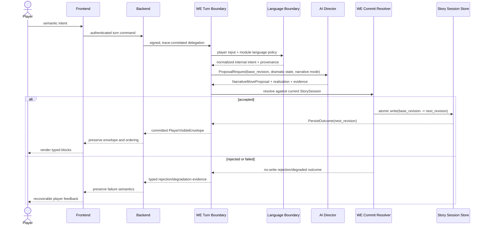

# Canonical player turn — implementation architecture

**Scenario ID:** `SCN-TURN-001`
**Normative owners:** [System SAD](../system/architecture.md),
[World Engine SAD](../components/world-engine/architecture.md)
**Decisions:** [ADR-0001](../decisions/ADR-0001-single-live-story-commit-authority.md),
[ADR-0002](../decisions/ADR-0002-versioned-turn-envelope.md),
[ADR-0004](../decisions/ADR-0004-player-visible-block-envelope.md),
[ADR-0007](../decisions/ADR-0007-bounded-emergent-narration.md),
[ADR-0008](../decisions/ADR-0008-module-language-boundaries.md)
**Implementation posture:** partial; see `AR-V001`, `AR-V002`, `AR-V004`, `AR-V010`, `AR-V011`

## 1. Preconditions

- authenticated player, bound role and versioned content module;
- active World Engine `StorySession` with a monotonic revision;
- at most one in-flight mutation for the session;
- explicit model-adapter and validation policy;
- trace identity created or propagated before the World Engine turn starts.

## 2. Observed implementation path

| Step | Current implementation anchor | Observed responsibility | Conformance note |
| ---: | --- | --- | --- |
| 1 | `backend/app/services/game/game_service.py::execute_story_turn` | budget guard and HTTP delegation | Backend must remain a proxy. |
| 2 | `world-engine/world_engine/api/http_routes/story_turn_routes.py::execute_story_turn` | internal-key boundary and trace scope | Conforming entry boundary. |
| 3 | `world-engine/world_engine/story_runtime/manager/turn_execution.py::_execute_turn_locked` | serialize session mutation and invoke graph | Canonical manager entry. |
| 4 | `world-engine/world_engine/story_runtime/manager/turn_execution.py::_run_turn_graph_for_session` | request AI proposal | Proposal vocabulary remains partly ambiguous. |
| 5 | `world-engine/world_engine/story_runtime/manager/commit_finalization.py::_finalize_committed_turn` | resolve, mutate, project, diagnose and persist | Oversized mixed-responsibility repair seam (`AR-V005`). |
| 6 | `world-engine/world_engine/story_runtime/narrative_commit_resolution.py` | evaluate live transition and build commit work | World-owned decision boundary. |
| 7 | `world-engine/world_engine/story_runtime/canonical_turn_lifecycle.py` | enforce lifecycle ordering | Lifecycle exists; correspondence remains incomplete. |
| 8 | `world-engine/world_engine/story_runtime/manager/story_window_entry_parts.py` | build player projection | Typed envelope is not yet the only delivery contract. |
| 9 | `world-engine/world_engine/story_runtime/story_session_store.py` | persist live story session | Must remain the single session sink. |
| 10 | `world-engine/world_engine/api/story_ws.py` or HTTP response | deliver committed blocks | Delivery modes must preserve identical ordering and identity. |

Observed code is evidence, not permission. A path marked nonconforming remains visible until its
repair gate passes.

## 3. Normative target flow

The target has one authoritative transition: `StorySession(revision=n)` plus an accepted
`CommitDecision` becomes `StorySession(revision=n+1)`. Every other step is read, proposal,
validation, projection or delivery. In bounded-emergence mode the canonical path is a reference
arc for the Director; it is not a second transition authority and not an automatic prose template.

## 4. Turn-envelope correspondence

| Field group | Introduced by | Required through | Intentional discard authority |
| --- | --- | --- | --- |
| `trace_id`, `session_id`, `turn_id`, `base_revision` | turn boundary | persistence and delivery evidence | none |
| interpreted intent, module language and translation provenance | language boundary | commit decision and visible output | explicit versioned adapter only |
| narrative mode and canonical-path role | module/profile policy | planner, compatibility projection and trace | content-version migration only |
| dramatic-state target and reference opportunities | AI Director | commit decision and committed dramatic context | explicit validation reason |
| responder and dramatic plan | AI proposal | committed dramatic context | explicit commit-resolution reason |
| continuity impacts and state deltas | AI proposal | commit or rejection evidence | validation policy |
| beat progression | World Engine resolution | player projection | player-safety projection policy only |
| visible blocks and speaker identity | post-commit projection | frontend renderer | no transport may infer or discard silently |

The machine-readable drift envelope remains in
`tools/architecture_assurance/drift_edge_catalog.json`; this scenario is its human architectural
meaning.

## 5. State and persistence rules

1. The session lock is acquired before reading the base revision.
2. AI calls never receive a live-session writer.
3. Validation rejection performs no authoritative write.
4. Accepted commit advances the session revision exactly once.
5. Player projection is derived from the accepted commit and resulting session.
6. Persistence outcome is explicit; callers cannot equate object mutation with durable success.
7. Delivery occurs only for committed or explicitly typed degraded/rejected outcomes.

Resource ownership is detailed in [data ownership](../data/data-ownership.md).

## 6. Failure modes

| Failure | Required behavior | Forbidden behavior |
| --- | --- | --- |
| provider timeout | typed degraded or retry result, same committed revision | fabricated narrative commit |
| proposal validation failure | actionable rejection evidence, no write | partial state mutation |
| stale base revision | concurrency rejection and reload | last-write-wins overwrite |
| persistence failure | explicit failed `PersistOutcome`; no success delivery | reporting committed success from memory only |
| projection failure | retain committed evidence and expose repairable delivery failure | second commit to repair rendering |
| telemetry failure | domain flow continues with `trace_partial=true` | changing story outcome |
| unknown block version | safe unsupported-version rendering | guessing missing authority fields |

## 7. Observability

The trace tree must contain backend delegation, World Engine turn root, proposal call, validation,
commit/persist outcome and delivery projection. Missing spans are explicit gaps. Raw credentials,
unredacted secrets and unrestricted player text are never architecture evidence.

## 8. Executable acceptance

- rejected proposal preserves persisted revision and payload hash;
- one accepted turn records exactly one live-story-session sink call;
- a seeded distinctive field survives every required envelope edge;
- primary REST and WebSocket delivery expose the same committed block order and speaker identity;
- provider and telemetry failure tests prove domain/telemetry isolation;
- reconnect tests prove replay without duplicate commit;
- architecture sequence gate proves a connected entry-to-response path and an explicit no-write alt.
