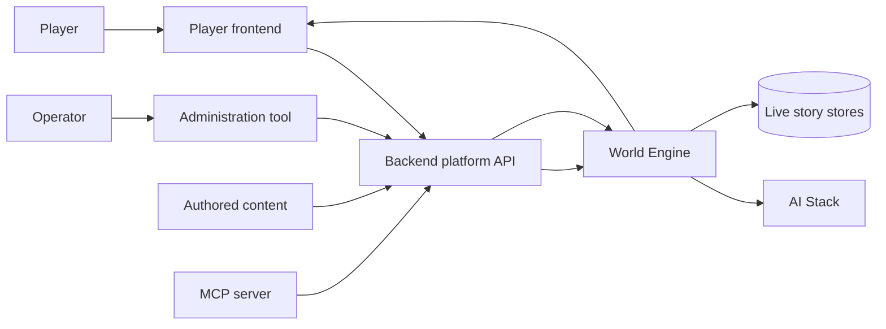

# Better Tomorrow / World of Shadows — System Architecture (arc42)

This is the single whole-system architecture authority. Component SADs describe local
implementation; concept documents describe crosscutting rules; active ADRs explain
decisions; the violation register exposes known differences between code and target.

## 1. Introduction & Goals

Better Tomorrow is a guided interactive-drama platform. A player launches authored
content through the platform, submits free semantic intent, and receives a committed,
role-sensitive story response. The defining architectural property is not AI generation
but controlled transition from an untrusted proposal to authoritative story truth.

### 1.1 Quality goals

| Priority | Goal | Concrete scenario |
| ---: | --- | --- |
| 1 | Single story authority | A rejected or failed proposal cannot advance the live session revision. |
| 2 | Semantic preservation | Responder identity, dramatic intent, beat effect and consequences survive every intentional boundary or are rejected explicitly. |
| 3 | Player-visible truth | Every rendered block derives from a committed, versioned player projection. |
| 4 | Repairability | A known implementation conflict is visible as a violation with lineage, owner, target and executable closure evidence. |
| 5 | Operability | One trace identity explains the backend, world-engine, AI and delivery portions of a turn without exposing secrets. |

### 1.2 Architecture statement types

| Marker | Meaning | May define target behavior? |
| --- | --- | --- |
| `Observed` | Verified current code or runtime behavior | No |
| `Normative` | Accepted architecture and invariant | Yes |
| `Target` | Proposed or accepted future shape not yet conforming | Only through an ADR |
| `Violation` | Observed conflict with a normative statement | No |
| `Historical` | Git or archived intent used for explanation | No |

## 2. Constraints

- `world-engine` is the only owner of live narrative commit and live story-session revision.
- AI output is proposal-only; validation inside AI cannot become a second live commit.
- Authored YAML is content truth. Runtime representations are versioned projections.
- Backend owns identity, community and control-plane persistence, not live story truth.
- Frontend renders committed player projections and cannot infer missing authority fields.
- Current implementation errors remain documented until behavioral closure evidence exists.
- [Active ADRs](../decisions/README.md) define current decisions. Retired ADRs are lineage only.
- [Architecture violations](../violations/README.md) are first-class architecture state.

## 3. Context & Scope

### 3.1 Authority boundaries

| Scope | Owns | Must not own | Current posture |
| --- | --- | --- | --- |
| Frontend | interaction state and rendering | story outcome or missing speaker inference | Partial; see `AR-V004` |
| Backend | identity, launch, proxy and control plane | live narrative commit | Conforming with monitored transitional surfaces |
| World Engine | live session, validation, commit, persistence, projection | authored content truth | Partial; see `AR-V001`, `AR-V002` |
| AI Stack | retrieval, planning, realization, proposal evidence | live session revision | Conflicting vocabulary; see `AR-V001` |
| Content Authority | authored module and compile policy | live beat progression | Multiple projections; see `AR-V003` |
| Architecture Assurance | evidence, drift and conformance reports | runtime-product truth | Operational; `AR-V009` resolved and unmapped backlog visible |

The system context is refined by the
[ecosystem model](../../../UML/Project/ecosystem-topology/README.md). Historical topology is
available through [architecture lineage](../evidence/architecture-lineage.md), never by
overwriting the present model with an old snapshot.

## 4. Solution Strategy

The target architecture follows six rules:

1. **One authority transition.** AI produces `ValidatedProposal`; World Engine alone produces
   `CommitDecision` and advances live revision.
2. **One versioned turn envelope.** Each narrowing or enrichment step declares consumed,
   preserved, added and intentionally discarded fields.
3. **One compiled content projection.** Runtime consumers use a version-bound projection of
   authored YAML through explicit adapters.
4. **One player projection contract.** Delivery modes consume the same committed block envelope.
5. **One cross-service trace tree.** Local telemetry adapters implement a shared redacted trace
   contract and report gaps explicitly.
6. **Architecture as verified correspondence.** Git lineage explains origin; active ADRs define
   intent; source and tests demonstrate current conformance; violations hold the delta.

These are target rules, not blanket claims about the existing code. Their implementation state is
tracked in the [violation register](../violations/README.md).

## 5. Building Block View

### 5.1 Level 1 — runtime and control-plane boundaries

| Building block | Kind | Responsibility | Primary implementation | Architecture owner |
| --- | --- | --- | --- | --- |
| Player Frontend | deployable | launch, input, stream consumption, rendering | `frontend/` | [Frontend SAD](../components/frontend/architecture.md) |
| Administration Tool | deployable | governed operator interaction | `administration-tool/` | [Administration SAD](../components/administration-tool/architecture.md) |
| Backend | deployable | platform API, auth, launch, proxy, governed persistence | `backend/` | [Backend SAD](../components/backend/architecture.md) |
| World Engine | deployable | authoritative live story runtime | `world-engine/` | [World Engine SAD](../components/world-engine/architecture.md) |
| AI Stack | runtime collaborator | retrieval, planning, realization, proposal validation | `ai_stack/` | [AI Stack SAD](../components/ai-stack/architecture.md) |
| Story Runtime Core | shared library | host-neutral contracts and value objects | `story_runtime_core/` | [Core SAD](../components/story-runtime-core/architecture.md) |
| Content Authority | authored data + compiler boundary | authored module truth and deterministic projection | `content/`, backend compiler | [Content SAD](../components/content-authority/architecture.md) |
| MCP Server | deployable adapter | bounded automation and inspection | `tools/mcp_server/` | [MCP SAD](../components/mcp-server/architecture.md) |

`model-governance` is a backend module, not a deployable. Architecture Assurance is a repository
toolchain, not a product runtime. Both may have implementation portfolios without becoming peer
runtime systems.

### 5.2 Level 2 — authoritative turn slice

The critical slice is decomposed in the
[canonical turn scenario](../scenarios/canonical-turn.md) and the
[World Engine component views](../../../UML/Components/world-engine/README.md). The architectural
unit is the responsibility boundary—not every discovered function.

## 6. Runtime View

| Scenario | Trigger | Success boundary | Failure boundary | Detail |
| --- | --- | --- | --- | --- |
| Session launch | authenticated player selects module and role | version-bound live session | no partially bound session | [Canonical turn preconditions](../scenarios/canonical-turn.md#1-preconditions) |
| Player turn | free semantic player input | one committed revision and player projection | explicit no-write rejection or degraded response | [Canonical turn](../scenarios/canonical-turn.md) |
| Reconnect | transport loss | ordered replay without duplicate commit | explicit resync failure | [Player/session contracts](../contracts/session_sync_contract.md) |
| Content publication | reviewed authored revision | deterministic compiled projection | active version unchanged | [Content SAD](../components/content-authority/architecture.md) |
| Governed admin mutation | authorized operator change | audited control-plane mutation | no partial secret/config update | [Security concept](../concepts/README.md) |

The player turn is the first L3 implementation model. Further scenarios must use the same format:
preconditions, current path, target path, state transitions, failure modes, data correspondence,
observability and executable acceptance.

## 7. Deployment View

The deployable topology and trust boundaries are defined in
[deployment topology](../data/deployment-topology.md). In summary:

- frontend, administration tool, backend and world-engine are separate processes;
- AI Stack is invoked through adapters whose physical placement may be in-process or remote;
- live story persistence is owned by World Engine;
- backend databases and governance stores do not become live story mirrors;
- secrets cross only named trust boundaries and never enter architecture evidence.

## 8. Crosscutting Concepts

| Concept | Normative question | Authority |
| --- | --- | --- |
| Authority and consistency | Who may change which truth, under what revision rule? | This SAD + ADR-0001 |
| Data correspondence | Which fields survive proposal, commit, projection and delivery? | ADR-0002 + scenario contracts |
| Security | Which principal may cross each mutation boundary? | [Security portfolio](../project/security-governance/architecture.md) |
| Observability | How is a turn correlated and how are gaps/redaction represented? | ADR-0005 |
| Narrative governance | How can play remain free while preserving dramatic identity and hard world truth? | ADR-0007 |
| Language boundaries | Which declared language is used for grounding and when is translation required? | ADR-0008 |
| Quality and proof | What evidence moves a claim from implemented to verified? | [Quality portfolio](../project/quality-gates/architecture.md) |
| Architecture lineage | Why does a path exist and when did it become stale? | [Lineage evidence](../evidence/architecture-lineage.md) |

Crosscutting portfolios are subordinate to this system SAD and their linked active ADRs. They do
not define a second whole-system topology.

## 9. Architecture Decisions

| ADR | Decision | Implementation posture |
| --- | --- | --- |
| [ADR-0001](../decisions/ADR-0001-single-live-story-commit-authority.md) | Single live story commit authority | Partial / monitored |
| [ADR-0002](../decisions/ADR-0002-versioned-turn-envelope.md) | Versioned end-to-end turn envelope | Partial |
| [ADR-0003](../decisions/ADR-0003-single-compiled-content-projection.md) | Single compiled content projection | Nonconforming |
| [ADR-0004](../decisions/ADR-0004-player-visible-block-envelope.md) | Player-visible block envelope | Partial |
| [ADR-0005](../decisions/ADR-0005-cross-service-turn-trace.md) | Cross-service turn trace | Partial |
| [ADR-0006](../decisions/ADR-0006-honest-architecture-evidence.md) | Direct coverage and known violations | Implementing |
| [ADR-0007](../decisions/ADR-0007-bounded-emergent-narration.md) | Bounded emergent narration | Partial |
| [ADR-0008](../decisions/ADR-0008-module-language-boundaries.md) | Module-owned language boundaries | Partial |

Detailed historical decisions remain in component portfolios and the retired archive. If a
historical decision still governs the target, it must be represented by an active ADR above or by
an explicitly owned component ADR.

## 10. Quality Requirements

| ID | Scenario | Acceptance measure |
| --- | --- | --- |
| Q-01 | Validation rejects a proposal | live revision and persisted session hash remain unchanged |
| Q-02 | One production player turn | exactly one World Engine commit decision and at most one live-session write |
| Q-03 | Distinct planner values enter the proposal | every required field is observed after commit/delivery or has an explicit discard decision |
| Q-04 | Provider fails mid-turn | no fabricated commit; player receives typed degraded/retry outcome |
| Q-05 | WebSocket reconnects | visible block order and speaker identity match committed sequence without duplicates |
| Q-06 | Bound source changes after reconciliation | architecture freshness gate marks the owning document stale |
| Q-07 | Current code is not modeled | report counts it as unmapped implementation, never as represented architecture |
| Q-08 | Player performs three valid off-path actions | pressure and continuity develop without mandatory canonical dialogue or a second writer |
| Q-09 | Source and target languages vary | translation occurs iff they differ and preserves typed block identity plus provenance |

## 11. Risks & Technical Debt

The [architecture violation register](../violations/README.md) is normative for known
nonconformance. The highest-risk items are competing commit semantics, incomplete turn-envelope
correspondence, multiple content projections, flattened player delivery and fragmented trace
identity.

An unresolved violation may coexist with an accepted ADR. `Accepted` means the target decision is
settled; it does not mean the implementation conforms. Closure requires the acceptance evidence in
the violation entry and a reconciliation commit.

## 12. Glossary

| Term | Meaning |
| --- | --- |
| Architecture authority | Document or decision allowed to define intended system behavior |
| Implementation truth | Behavior demonstrated by current source and executable tests |
| Historical intent | Prior design or code evidence explaining origin without current authority |
| Conformance | Verified agreement between implementation and a normative decision |
| Violation | Known disagreement or proof gap between implementation and target |
| Projection | Derived representation that cannot supersede its source authority |
| Turn envelope | Versioned correspondence across interpretation, proposal, commit and delivery |
