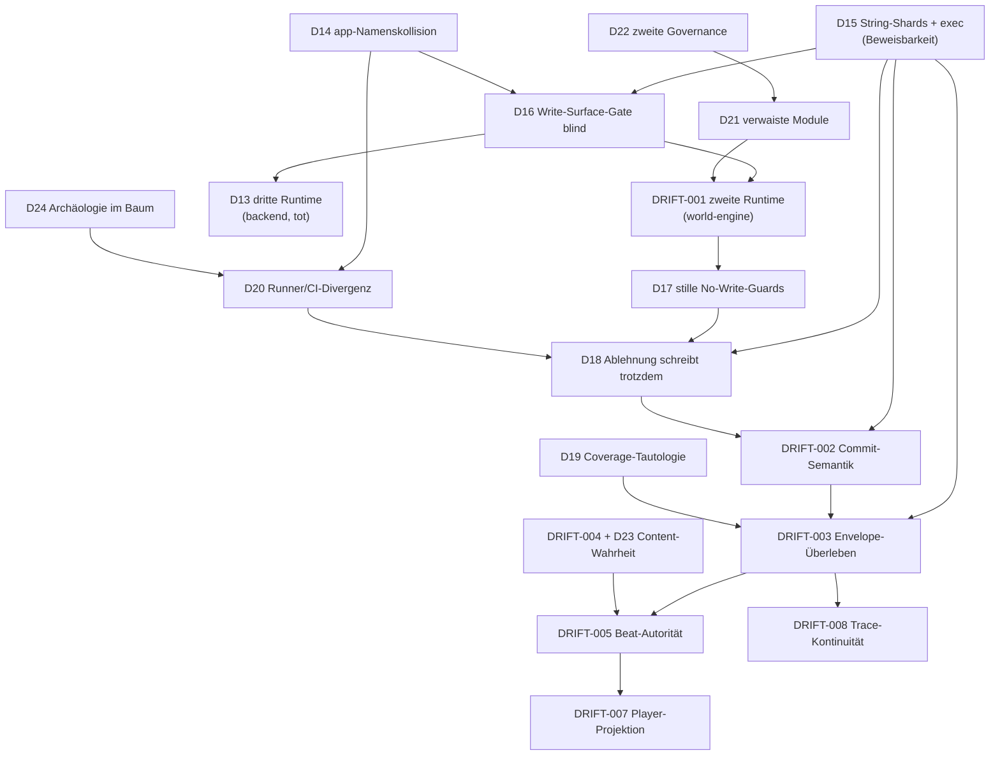

# Better Tomorrow — Driftlandschaft: Ist-Analyse (Phase 1–4)

**Stand:** 2026-07-31 · **Basis:** Worktree `D:\WorldOfShadows`, Branch `master`, HEAD `f06308d1`
**Status:** Analyse- und Entscheidungsvorlage. **Keine** Umbauten, **keine** Löschungen durchgeführt.

---

## 0. Ausgangszustand (read-only geprüft)

| Punkt | Befund |
| --- | --- |
| Branch / HEAD | `master` @ `f06308d1` „ci: publish UML preview artifact" |
| Remote | `https://github.com/Held0fTheWelt/BETTER-TOMORROW.git` |
| Uncommittete Änderungen | 21 modifiziert + 4 unversioniert — **alle** im Umfeld `tools/architecture_assurance`, `UML/Project/architecture-drift`, `tests/architecture_assurance`, `docs/architecture/…`. Gehören dem Benutzer, wurden **nicht** angefasst. |
| Neu (unversioniert) | `drift_edges.py`, `drift_edge_catalog.json`, `test_drift_edges.py`, `UML/Project/architecture-drift/` |
| Worktrees (git) | `.worktrees/phase-6b5f` (aktiv), ein **prunable** Eintrag `D:/TinyToolDevelopment/worktrees/better-tomorrow-akdb-modernization` |
| Worktrees (Datenträger, **nicht** in git) | `.worktrees/mvp-v24-integration/`, `.claude/worktrees/coverage-improvement/` — verwaiste Repo-Kopien im Arbeitsbaum |

**Untersuchte Evidenzquellen:** die genannten Ausgangsartefakte (`drift_claim_catalog.json`, `drift_edge_catalog.json`,
`drift_edges.py`, `model_catalog.json`, `config.json`, `architecture-drift-reconciliation.md`,
`architecture-drift-baseline.json`, `architecture-assurance/architecture.md`, `runtime-authority-and-envelope.puml`,
`architecture-assurance.yml`), zusätzlich: `world-engine/app/**`, `backend/app/**`, `ai_stack/**`,
`story_runtime_core/**`, `frontend/static/**`, `tests/**`, alle 15 CI-Workflows, `conftest.py`, `pyproject.toml`,
`pytest.ini`, `.gitignore`, `git log`/`git ls-files`, sowie das Archiv `E:\New folder` (nur klassifiziert).

**Analyseachsen:** (A) Autorität & Write-Pfade · (B) Turn-/Envelope-Fluss · (C) Content-Wahrheit ·
(D) Statische Analysierbarkeit des Produktionscodes · (E) Test-/CI-Wahrheit · (F) Legacy- & Retirement-Graph ·
(G) Wirksamkeit der bestehenden Gates.

---

## 1. Executive Summary

Die dokumentierte Driftlandschaft (`DRIFT-001`…`DRIFT-012`) beschreibt reale Probleme, ist aber in drei Punkten
**nicht belastbar**:

1. **Sie ist unvollständig.** Der Produktionsbaum enthält **drei** Runtime-Generationen und **mindestens sechs**
   Persistenzsenken. Der Katalog modelliert eine Generation und eine Senke.
2. **Sie ist teilweise falsch klassifiziert.** `DRIFT-001` ist nicht „conflicting mit Kompatibilitätsnaht", sondern
   ein **aktiver zweiter Writer im selben Prozess**. `DRIFT-012` ist als `confirmed_current` markiert, obwohl die
   dahinterliegende Kennzahl weiterhin tautologisch ist.
3. **Die Gates messen überwiegend den Katalog, nicht den Produktionspfad.** Der einzige echte Quell-Scan
   (`validate_authoritative_write_surfaces`) sucht **eine** wörtliche Aufrufform (`self._session_store.save`) und
   findet deshalb genau die eine Stelle, die ohnehin erlaubt ist.

Der schwerwiegendste Einzelbefund ist strukturell und bisher nirgends erfasst: **202 Produktionsmodule enthalten
keinen Python-Code, sondern Python-Quelltext als Zeichenketten**, der zur Importzeit per `exec(compile(...))`
zusammengesetzt wird — darunter die **komplette spielerseitige Backend-Game-API** (29 Dateien) und der
**AI-Validierungs-/Commit-Seam**. Für diese Teile ist *jede* statische Aussage — Importgraph, Callsite-Scan,
Drift-Gate, Linter, Typprüfung — blind. Das entwertet die Beweiskraft der gesamten Assurance-Kette genau dort,
wo Autorität entschieden wird.

**Kernaussage:** Das Projekt hat nicht ein Driftproblem, sondern ein **Wahrheitsproblem**: Es ist mit den heute
vorhandenen Mitteln nicht entscheidbar, welcher Code den Spielzug tatsächlich ausführt und wer die Session
schreibt. Alles Weitere (Envelope-Felder, Beat-Autorität, Player-Projektion) ist erst danach beweisbar.

---

## 2. Systemische Ursachen (nicht Einzelsymptome)

| # | Ursache | Evidenz | Wirkung |
| --- | --- | --- | --- |
| U1 | **Metrikgetriebenes Refactoring** („despaghettify"): Dateien wurden auf Größenmetriken getrimmt, indem Code in Strings verwandelt wurde. | `git log` Commits `0f2a41239`, `63dd1c1b5`, `c8a76d829`, `8ca3dfc43`; `backend/app/api/v1/game_routes.py:44-68`; `world-engine/app/story_runtime/manager/_legacy_loader.py:24` | Produktionscode ist statisch unsichtbar → alle Gates verlieren Beweiskraft |
| U2 | **Additive Reparaturwellen ohne Retirement**: jede Welle legte eine neue Generation *neben* die alte. | 3× `RuntimeManager`; `world-engine/app/main.py:415-427` instanziiert **beide** Manager | Konkurrierende Autoritäten, tote Parallelwelten |
| U3 | **Gates prüfen Deklaration statt Verhalten**: Katalog↔Katalog, Token-Präsenz, tautologische Coverage. | `drift_edges.py:550` (`token not in path.read_text()`); `audit.py:240-242,313` | Grüne Statistik bei realer Drift |
| U4 | **Zwei konkurrierende Governance-Welten** im selben Repo. | `'fy'-suites/` = 1047 getrackte Dateien (größtes Verzeichnis) mit eigenem Legacy-Register `delagecy/legacy_removal_tracker.md` | Zwei „Wahrheiten" über Legacy-Status |
| U5 | **Paket-/Pfad-Mehrdeutigkeit**: `backend/app` und `world-engine/app` heißen beide `app`. | `conftest.py:33-37` (`sys.path.insert(0, backend)`, `insert(1, world-engine)`) | Derselbe Import bindet je nach Suite anderen Code |
| U6 | **Dateiname/Label als Statusbeweis** (historisch bereits als `DRIFT-011` erkannt, wirkt aber weiter). | `_legacy_*`-Namen bei produktiv genutztem Code; `legacy_removal_tracker.md:283` „approved_for_removal" für noch geladenen Code | Falsche Sicherheit über Ablösestand |

---

## 3. Gefährlichste Drifts — priorisiert

| Rang | ID | Kurzfassung | Warum zuerst |
| ---: | --- | --- | --- |
| 0 | **D27 + D29** | 3–7 Modellaufrufe pro Zug, davon bis zu 5 **nicht kostenattribuiert**; kein Budget; degradierter Commit ist Default | Das ist der Grund, warum das Spiel zu teuer war und die Kosten nicht diagnostizierbar waren. Billigste und schnellste Wirkung; unabhängig von allem anderen umsetzbar. |
| 0b | **D31** | Commit-Vokabular (4 Werte) ist ärmer als das KI-Auflösungsvokabular (7+ Werte); freie Handlungen ohne Szenenübergang werden `blocked`, Beat friert ein | Technischer Grund, warum freies Rollenspiel nur teilweise funktionierte. Trifft direkt das Produktziel. |
| 1 | **D15** | 202 Module als String-Shards + `exec` — u. a. gesamte Backend-Game-API und AI-Commit-Seam | Blockiert *jeden* Beweis. Ohne Auflösung ist keine andere Drift verifizierbar schließbar. |
| 2 | **D16** | Write-Surface-Gate erfasst 1 von ≥27 Persistenz-Callsites | Die Kernaussage „genau ein autoritativer Writer" ist heute unbelegt und faktisch falsch. |
| 3 | **DRIFT-001↑** | `world-engine/app/runtime` ist kein Kompatibilitätspfad, sondern aktiver zweiter Writer (11 Callsites) im selben Prozess | Direkter Autoritätsbruch im Live-Prozess. |
| 4 | **D26** | Die maßgebliche World-Engine besitzt **kein** Delta-/Guard-/Mutations-/Recovery-Modell — diese Fähigkeiten existieren nur in der stillgelegten Backend-Generation | Ursache hinter DRIFT-002/003 und D18: „Ablehnung ändert nichts" ist in der World-Engine heute **nicht ausdrückbar**. |
| 4b | **D13** | Backend-Runtime-Cluster (22 184 Z., 175 Commits) ist zweigeteilt: lebende Routing-Governance + ruhende Turn-Engine | Darf nicht pauschal gelöscht werden; Migration vor Retirement. |
| 5 | **D17/D18** | `_persist_session` hat zwei stille No-Write-Guards; abgelehnte Proposals verändern vermutlich trotzdem die persistierte Revision | Trifft die DoD-Zusage „Ablehnungen verändern keine persistierte Revision". |
| 6 | **D14** | `app`-Namenskollision, aufgelöst über `sys.path`-Reihenfolge | Macht „welcher Code lief?" strukturell unentscheidbar; erzeugt CI/lokal-Divergenz. |
| 7 | **D19/DRIFT-012↓** | Repräsentationsdeckung tautologisch; Gate erzwingt 1.0 bei 319/373 „out of scope" in world-engine | Die Kennzahl, die Vertrauen erzeugt, misst nichts. |
| 8 | **D20/DRIFT-009** | CI ruft `pytest` direkt, nicht den 2538-Zeilen-Suite-Katalog | Runner- und CI-Wahrheit divergieren strukturell, nicht versehentlich. |

---

## 4. Driftregister

Legende Status: `confirmed current` · `conflicting` · `open target` · `superseded` · `newly discovered`
Legende Evidenzklasse: **[B]** beobachtete Drift (Quellcode belegt) · **[V]** vermutete Drift (statisch stark
indiziert, Laufzeitbeweis offen) · **[H]** historisches Problem · **[R]** bereits repariert · **[Z]** Zielentscheidung
offen.

> Hinweis zur Ehrlichkeit: Ich habe in dieser Umgebung **keinen Code ausgeführt** (kein Build, kein pytest, keine
> Laufzeit). Alle Aussagen sind quell- und git-belegt. Wo Verhalten entscheidend ist, ist das als **[V]** markiert
> und mit dem konkret erforderlichen Test versehen.

---

### D15 — Produktionscode existiert als Zeichenkette und wird zur Importzeit ausgeführt

* **Kategorie:** statische Analysierbarkeit / Architekturwahrheit · **Status:** `newly discovered` · **Evidenz:** [B]
* **Schweregrad:** kritisch. Begründung: entwertet alle statischen Gates genau im Autoritätsbereich.
* **Betroffene Fähigkeit:** jede Nachweisführung; indirekt Spielerpfad (Backend-Game-API).
* **Ist-Pfad:**
  * `backend/app/api/v1/game_routes.py:44-68` — liest 29 Dateien, holt aus jeder das Attribut `SOURCE`,
    konkateniert und führt `exec(compiled, globals())` aus. Die 29 Dateien sind u. a.
    `player_turn_trace_start.py`, `player_turn_execution_and_flush.py`, `ensure_player_session_resume.py`,
    `player_session_binding_persistence.py`.
  * `world-engine/app/story_runtime/manager/_legacy_loader.py:13-24` — `load_source()` + `exec_top_level()`;
    `_legacy_methods.py:12-20` baut Methoden per `exec` an die Manager-Klasse.
  * `_legacy_sources/manifest.py:7-16` — u. a. `method:_finalize_committed_turn` aus **6** Shards.
  * `ai_stack/langgraph/runtime_executor/executor_validation_commit.py:5ff` — `SOURCE_LINES = [...]`.
  * `backend/app/services/governance/governance_runtime_service.py:70`, `tools/mcp_server/handlers/langfuse_verify/loader.py:64`.
* **Umfang (gezählt):** Module mit `SOURCE`/`SOURCE_LINES`: `ai_stack` 63 · `backend/app` 66 · `tools` 43 ·
  `world-engine/app` 30 = **202**.
* **Soll-Pfad (dokumentiert):** `DRIFT-006` fordert „explizite kohäsive Module" — adressiert aber nur den
  world-engine-Manager (≈31 Shards), also ~15 % des tatsächlichen Umfangs.
* **Abweichung:** Der Katalog behandelt ein subsystemlokales Aufräumthema; real ist es eine repoweite
  Architektureigenschaft, die den Beweisbegriff des gesamten Assurance-Systems bricht.
* **Autoritäten:** world-engine Manager (Commit-Finalisierung), ai_stack Validation-Seam, Backend-Game-API.
* **Envelope-Wirkung:** `_finalize_committed_turn` (Commit→persist) liegt in Shards →
  `method___finalize_committed_turn_005.py:63` ruft `self._persist_session(session)` **innerhalb eines Strings**.
* **Risiko isolierter Reparatur:** hoch — Rückbau ändert Import-Reihenfolge und Namensräume; ohne
  Characterization-Tests drohen stille Verhaltensänderungen.
* **Empfehlung (hoch):** Rückbau zu echtem Python **in der Reihenfolge der Autoritätsnähe**:
  (1) world-engine `_legacy_sources`/`_legacy_methods`, (2) `ai_stack/langgraph/runtime_executor`,
  (3) `backend/app/api/v1/game/`, (4) Rest. Danach ein Gate, das `SOURCE`-Module und `exec(compile(` in
  Produktionsrooten verbietet. **Alternative** (abgelehnt): nur Autoritätspfade zurückbauen — hinterlässt ein
  Repo, in dem „statisch unsichtbar" weiter normal ist und der Rückfall garantiert ist.
* **Confidence:** hoch.
* **Offene Entscheidung:** Umfang (alles vs. nur Autoritätspfade) → Frage Q2.
* **Tests:** Characterization je zurückgebautem Modul (Signatur + Verhalten vor/nach), Import-Smoke der App,
  Gate-Test „kein `SOURCE`-Modul in Produktionsrooten".
* **Cleaning:** `_legacy_loader.py`, `_legacy_methods.py`, `_legacy_sources/**` (33 Dateien), die 6 `legacy_*.py`
  Weiterleitungsmodule, `_IMPLEMENTATION_FILES`-Mechanik in `game_routes.py`, alle `SOURCE_LINES`-Module.
* **Abnahme:** Kein Produktionsmodul definiert `SOURCE`/`SOURCE_LINES`; kein `exec(compile(` in
  `world-engine/app`, `backend/app`, `ai_stack`; Importgraph vollständig per AST auflösbar.

---

### D16 — Der Write-Surface-Scan erfasst eine von mindestens 27 Persistenz-Callsites

* **Kategorie:** Autorität / Gate-Wirksamkeit · **Status:** `newly discovered` · **Evidenz:** [B]
* **Schweregrad:** kritisch.
* **Ist-Pfad (gezählte Senken):**

  | Callsite | Anzahl | Ressource |
  | --- | ---: | --- |
  | `world-engine/app/story_runtime/manager/session/manager_init_and_persistence.py:269` `self._session_store.save` | 1 | `live_story_session` |
  | `world-engine/app/runtime/manager.py` `self.store.save(instance)` (Z. 85, 243, 281, 373, 396, 550, 560, 714, 739, 751) | 10 | `live_run_instance` (unmodelliert) |
  | `world-engine/app/api/http_routes/play_run_routes.py:95` `manager.store.save(instance)` | 1 | `live_run_instance`, **Route schreibt direkt am Manager vorbei** |
  | `backend/app/runtime/manager.py` `self.store.save(instance)` (Z. 160, 179, 271, 294, 398, 408, 423) | 7 | Backend-Run-Store (unmodelliert) |
  | `backend/app/runtime/session/session_store.py:192` `_persist_session_to_database` (raw SQL INSERT/UPDATE auf `runtime_sessions`) | 1 | DB-Session (unmodelliert) |
  | `manager_init_and_persistence.py:277,286,295,307` `_branching_tree_store` / `_branch_timeline_store` / `_callback_web_store` / `_consequence_cascade_store` | 4 | vier Nebenstores (unmodelliert) |
  | `ai_stack/rag/rag_runtime_bootstrap.py:42` `store.save(corpus)` | 1 | RAG-Korpus |

* **Soll-Pfad (dokumentiert):** `drift_edge_catalog.json:281-300` — genau **ein** `write_surfaces`-Eintrag,
  `call: "self._session_store.save"`, `minimum_calls: 1`, `maximum_calls: 1`.
* **Abweichung:** Der Scan ist ein exakter AST-Abgleich des punktierten Namens (`drift_edges.py:163-174`). Jede
  andere Schreibweise — `self.store.save`, `manager.store.save`, `store.save`, DB-Zugriff, Alias über eine lokale
  Variable — ist unsichtbar. Zusätzlich: Shard-Module (D15) parsen als String-Literale, ihr Inhalt wird nie geprüft.
* **Empfehlung (hoch):** `write_surfaces` von *einem Aufrufmuster* auf *ein Ressourcenmodell* umstellen:
  je Ressource (`live_story_session`, `live_run_instance`, `branching_tree`, `branch_timeline`, `callback_web`,
  `consequence_cascade`, `backend_runtime_session`) Sink-Typ **und** erlaubte Callsites deklarieren; Scan über
  *Methodenname am bekannten Store-Typ* statt über einen literalen Ausdruck; zusätzlich ein Verbots-Scan für
  „Route/Adapter ruft `*.store.save`". **Alternative:** nur zusätzliche Literale eintragen — abgelehnt, hält die
  Lücke offen und wächst mit jedem Rename.
* **Confidence:** hoch. **Tests:** Negativtest je Ressource (neuer Fremd-Callsite ⇒ Gate rot), Alias-Test
  (`s = self._session_store; s.save(...)` ⇒ Gate rot).
* **Abnahme:** Jede Persistenzressource hat genau einen deklarierten Sink; ein künstlich eingefügter zweiter
  Writer bricht das Gate; Shard-Rückbau (D15) abgeschlossen, sonst bleibt der Scan blind.

---

### DRIFT-001 (Neubewertung) — Konkurrierende Live-Runtime-Strukturen

* **Status bisher:** `conflicting` → **neu: `confirmed current`, Schweregrad hoch**
* **Evidenz:** [B]
* **Ist-Pfad:** `world-engine/app/main.py:415-427` instanziiert **beide** Manager im selben Prozess
  (`RuntimeManager(store_root=RUN_STORE_DIR, …)` **und** `StoryRuntimeManager(session_store=…)`), verbindet sie
  über `runtime_manager.attach_story_manager(story_manager)` und legt beide in `app.state`.
  `common.py:67-72` liefert beide als FastAPI-Dependencies. `app/runtime/manager.py` besitzt einen **eigenen**
  `RunStore` (`app/runtime/store.py`) und schreibt 10×.
* **Abweichung zum Soll:** Der Katalogeintrag beschreibt `world-engine:runtime` als
  `compatibility_delegate` mit Vertrag „darf übersetzen und delegieren, aber **nie** Live-Session-Zustand
  persistieren" (`drift_edge_catalog.json:8-18`). Real persistiert es eine eigene Ressource und ist keine
  Delegationsfassade, sondern eine gleichrangige Runtime.
* **Empfehlung (hoch):** Die Ressourcen **trennen und benennen**, statt sie zu vermischen:
  `live_run_instance` (Lobby/Run/Teilnehmer/Tickets) bleibt Aufgabe von `app/runtime`, wird aber als **eigene
  Ressource mit eigenem Autoritätsinvariant** modelliert; `live_story_session` bleibt exklusiv beim
  Story-Manager. Danach: alles, was in `app/runtime` Story-/Beat-/Turn-Semantik berührt, retiren.
  **Alternative A:** `app/runtime` vollständig auflösen und in den Story-Manager ziehen — höheres Risiko,
  vermischt Lobby- und Erzählautorität. **Alternative B:** Status quo dokumentieren — abgelehnt, erzeugt genau
  die zweite Wahrheit, die der Auftrag verbietet.
* **Confidence:** hoch für den Befund; **mittel** für die Zielvariante → Frage Q1.
* **Cleaning:** `play_run_routes.py:95` (Route schreibt direkt), danach alle Story-nahen Methoden in
  `app/runtime/manager.py`.
* **Abnahme:** Zwei disjunkte, je einzeln modellierte Schreibtopologien; kein Modul schreibt beide Ressourcen;
  keine Route schreibt an einem Manager vorbei.

---

### D13 — Der Backend-Runtime-Cluster ist zweigeteilt: lebende Routing-Governance + ruhende Turn-Engine

* **Kategorie:** Legacy / Parallelautorität / **Fähigkeitslücke** · **Status:** `newly discovered` · **Evidenz:** [B]
* **Schweregrad:** hoch.
* **Umfang:** `backend/app/runtime/` = **22 184 Zeilen** in 13 Subpaketen, **175 Commits** (world-engine/app/runtime:
  43). Das ist keine vergessene Ecke, sondern eine intensiv entwickelte Generation.
* **Reichweite — präzise gemessen** (externe Produktionsreferenzen aus `backend/app/**` außerhalb des Clusters):

  | Teil | Externe Prod-Referenzen | Bewertung |
  | --- | ---: | --- |
  | `routing/`, `model_routing`, `model_routing_contracts` | 10 / 11 | **lebt** — Writers Room + Improvement-Services |
  | `routing_registry_bootstrap` | 1 (`factory_app.py`) | **lebt** — App-Start |
  | `runtime_models` (`SessionState`), `session/session_persistence` | je 1 (`services/data/persistence_service.py`) | **lebt** |
  | `input_interpreter` | 1 (`services/improvement/improvement_service.py`) | **lebt** |
  | `manager.py` | 1 (nur Namensraum-Treffer) | ruhend |
  | `engine`, `turn/`, `narrative/`, `ai/`, `ai_turn/`, `supervisor/`, `validation/`, `presentation/`, `canonical/`, `transitional/`, `cache/`, `scene_legality`, `session/session_store` | **0** | **ruhend** |

* **Realer Produktionspfad:** Das Backend ruft die World-Engine per HTTP
  (`backend/app/services/game/game_service.py:13,218` `httpx.Client(base_url=…)`).
* **Korrektur gegenüber einer pauschalen „tot"-Einschätzung:** Der Cluster darf **nicht** als Ganzes entfernt
  werden. Der Routing-/Modell-Governance-Teil ist produktiv und trägt Writers Room, Improvement und den App-Start.
* **Abweichung:** Weder Drift-Katalog noch Modellkatalog kennen diesen Cluster — weder den lebenden noch den
  ruhenden Teil. Er zählt im Backend-SAD unter `out_of_scope`.
* **Empfehlung (hoch):** Dreiteilen statt löschen —
  (1) **behalten und modellieren:** Routing-/Modell-Governance als eigenes, benanntes Subsystem
  (nicht unter `runtime`, da es keine Turn-Autorität ist);
  (2) **migrieren:** die in D26 aufgelisteten Fähigkeiten in die World-Engine überführen;
  (3) **entfernen:** was nach (2) übrig bleibt, inklusive `session/session_store.py` und der Tabelle
  `runtime_sessions` — vorher Leser der Tabelle klären.
* **Confidence:** hoch (Reichweite gemessen), **mittel** bei `session_mirror`/DB-Tabelle (Leser außerhalb Python möglich).
* **Tests vorher:** Charakterisierung von `runtime_sessions` (wer liest?), Kontrakttests der lebenden Routing-APIs.
* **Abnahme:** Routing-Governance ist als eigenes Subsystem modelliert und gebunden; der ruhende Teil ist migriert
  oder entfernt; `runtime_sessions` hat keinen Leser; Import-Gate verbietet Wiedereinführung.

---

### D26 — Fähigkeitslücke: die maßgebliche World-Engine kann weniger als die stillgelegte Backend-Generation

* **Kategorie:** Autorität / Commit-Semantik · **Status:** `newly discovered` · **Evidenz:** [B]
* **Schweregrad:** **kritisch** — dies ist die Ursache hinter `DRIFT-002`, `DRIFT-003` und `D18`.
* **Befund:** Es gibt **zwei Implementierungen derselben Funktion** `resolve_narrative_commit`, mit
  **unterschiedlichen Fähigkeitsmodellen**:

  | | `backend/app/runtime/narrative/narrative_commit.py:72` | `world-engine/app/story_runtime/commit_models.py:577` |
  | --- | --- | --- |
  | Eingaben | `accepted_deltas`, `rejected_deltas`, `guard_outcome`, `post_delta_canonical_state`, `module` | `player_input`, `interpreted_input`, `generation`, `runtime_projection`, `prior_beat_progression` |
  | Modell | **Zustandsmutation** mit Guard + akzeptiert/abgelehnt | **Szenen-/Narrationsübergang** mit Beats |
  | Ablehnung | eigene Funktion `narrative_commit_for_source_gate_rejection` | **keine** |
  | Ende/Legalität | `SceneTransitionLegality.check_ending_legal` | nur Transition-Hints |
  | Beat-Progression | **nein** | ja |

* **Fähigkeiten, die es in `world-engine` und `ai_stack` gar nicht gibt** (Trefferzahl Dateien):

  | Fähigkeit | world-engine | ai_stack | backend |
  | --- | ---: | ---: | ---: |
  | `GuardOutcome` | **0** | **0** | 9 |
  | `accepted_deltas` / `rejected_deltas` | **0** | **0** | 15 |
  | `SceneTransitionLegality` / `check_ending_legal` | **0** | **0** | 5 / 4 |
  | `MutationPolicy` (`validation/mutation_policy.py`) | **0** | **0** | vorhanden |
  | Source-Gate + `commit_turn_result` (`turn/turn_executor.py`) | **0** | **0** | vorhanden |
  | AI-Failure-/Recovery-Modell (`ai/ai_failure_recovery.py`, 990 Z.: `RetryPolicy`, `ReducedContextRetryPolicy`, `FallbackResponderPolicy`, `SafeTurnPolicy`, `StateSnapshot`, `RestorePolicy`) | **0** | **0** | vorhanden |

  `StateDelta` erscheint in world-engine nur zweimal — beides in `app/runtime/state_delta.py` und
  `branching_turn_executor.py`, also im **verwaisten** Teil (D21).
  Gleichzeitig produziert `ai_stack` in **42 Dateien** `proposed_state_effects`.

* **Konsequenz:** Die KI schlägt Zustandseffekte vor, aber die maßgebliche Instanz besitzt **kein Modell für
  akzeptierte/abgelehnte Effekte**. Deshalb ist die DoD-Zusage „Ablehnungen verändern keine persistierte Revision"
  in der World-Engine heute nicht nur unbewiesen, sondern **nicht ausdrückbar**. Ebenso fehlen dort Degraded- und
  Recovery-Policies als Modell — es existieren nur punktuelle Fallbacks
  (`no_dead_end_recovery.py`, `fallback_generator.py`, `degradation_and_turn_blocks.py`).
* **Empfehlung (hoch):** Kein Löschen vor Migration. Die World-Engine wird Zielheimat, **muss aber zuerst die
  fehlenden Modelle erhalten**: (1) Delta-/Guard-Modell mit akzeptiert/abgelehnt, (2) MutationPolicy,
  (3) Source-Gate mit ablehnungsfähigem Commit, (4) Failure-/Recovery-Policies inkl. `StateSnapshot`/`RestorePolicy`,
  (5) Szenen-/Ending-Legalität. Übernommen wird das **Modell**, nicht der Code eins zu eins — der Backend-Code ist
  auf `SessionState`/`ContentModule` des Backends zugeschnitten und teilweise unvollständig.
* **Confidence:** hoch für die Lücke; **mittel** für „unvollständig" auf Backend-Seite (statisch nicht abschließend
  bewertbar, da nie produktiv aufgerufen).
* **Tests:** je migrierter Fähigkeit Kontrakttest gegen den **World-Engine-Produktionspfad**; insbesondere
  „abgelehnter Delta ⇒ Revision unverändert" (schließt D18) und „Degraded-Turn ⇒ markierter, nicht stiller Pfad".
* **Abnahme:** `GuardOutcome`, akzeptiert/abgelehnt, MutationPolicy, Source-Gate und Recovery-Policies existieren
  im World-Engine-Produktionspfad und sind durch Tests belegt; erst danach darf der ruhende Backend-Teil fallen.

---

### D14 — Paketnamenskollision `app` zwischen Backend und World-Engine

* **Kategorie:** Auflösbarkeit / CI-Divergenz · **Status:** `newly discovered` · **Evidenz:** [B]
* **Schweregrad:** hoch.
* **Ist-Pfad:** `backend/app/__init__.py` (595 B, echtes Paket) und `world-engine/app/__init__.py` (**0 Byte**).
  `conftest.py:33-37` setzt `sys.path.insert(0, backend)` und `insert(1, world-engine)` mit dem Kommentar
  „backend `app` must win over world-engine `app`". `world-engine/tests/conftest.py:113` re-importiert
  `app.runtime.manager` gezielt neu.
* **Abweichung:** Derselbe Importausdruck `from app.runtime.manager import RuntimeManager` bindet je nach Suite
  und Reihenfolge **unterschiedliche Klassen** (beide existieren, beide heißen `RuntimeManager`, beide schreiben
  einen Store). Damit ist die Frage „welcher Code lief?" nicht durch Lesen beantwortbar — Grundprinzip 7 des
  Auftrags ist strukturell verletzt.
* **Empfehlung (hoch):** Ein Paket umbenennen — `world-engine/app` → `world_engine` (echtes Paket mit Inhalt in
  `__init__.py`), Importe mechanisch anpassen, `sys.path`-Trickserei aus `conftest.py` entfernen.
  **Alternative:** Namespace beibehalten und nur dokumentieren — abgelehnt, hält Divergenz aktiv.
* **Confidence:** hoch für Befund, **mittel** für Umbenennungsaufwand (376 getrackte Dateien unter `world-engine`).
* **Offene Entscheidung:** Q4.
* **Tests:** Import-Determinismus-Test (gleicher Import ⇒ gleiche Datei, unabhängig von Suite/CWD).
* **Abnahme:** Keine `sys.path`-Manipulation in `conftest.py`; `python -c "import app; print(app.__file__)"` ist
  eindeutig; alle Suites laufen ohne Pfad-Vorspiel.

---

### D17 — `_persist_session` besitzt zwei stille No-Write-Guards und drei Aufrufer

* **Kategorie:** Transaktions-/Autoritätsgrenze · **Status:** `newly discovered` · **Evidenz:** [B]
* **Schweregrad:** hoch.
* **Ist-Pfad** (`manager_init_and_persistence.py:264-269`):
  ```python
  def _persist_session(self, session: StorySession) -> None:
      if session.session_id in self._branching_simulation_session_ids:
          return
      if self._session_store is None:
          return
      self._session_store.save(session.session_id, story_session_to_payload(session))
  ```
  Aufrufer: `opening_execution.py:314` (Session-Erzeugung), `player_visible_persistence.py:105` (nach Turn),
  `_legacy_sources/method___finalize_committed_turn_005.py:63` (**im String-Shard**).
* **Abweichung zum Soll:** `drift_edge_catalog.json:155-172` verspricht „Exactly one atomic session write occurs
  after an accepted CommitDecision; rejection performs no write." Real gibt es (a) zwei stille Rückgabepfade ohne
  Fehler oder Marker, (b) zwei Schreibpfade **außerhalb** einer CommitDecision (Opening, Player-Visible-Persistenz).
* **Empfehlung (hoch):** Persistenz auf **eine** Transaktionsfunktion mit expliziter Ergebnisrückgabe
  (`Persisted | SkippedSimulation | NoStoreConfigured`) umstellen; Opening als eigener, benannter
  Lifecycle-Übergang modellieren (nicht als „Commit"); jeder stille `return` wird zu einem beobachtbaren Ereignis.
* **Confidence:** hoch. **Tests:** Kontrakttest je Rückgabefall; Test „Simulationssession schreibt nie".
* **Abnahme:** Kein `return` ohne Ergebnisobjekt; Trace zeigt Skip als Skip, nicht als Erfolg.

---

### D18 — Abgelehnte/blockierte Proposals verändern vermutlich die persistierte Revision

* **Kategorie:** Commit-Semantik · **Status:** `newly discovered` · **Evidenz:** **[V]**
* **Schweregrad:** hoch (falls bestätigt).
* **Ist-Pfad:** `narrative_commit_resolution.py:37-90` liefert bei unbekannter Zielszene, fehlenden
  Transition-Hints oder illegalem Übergang `allowed=False` / `situation="blocked"`. Der spielerseitige
  Persistenzpfad `player_visible_persistence.py:88-105` hängt jedoch **unbedingt** `canonical_record` an
  `session.history`, `event` an `session.diagnostics`, setzt `session.updated_at` und ruft `_persist_session`.
* **Abweichung:** DoD und `DRIFT-002`-Abnahme fordern „rejected proposals leave the world revision unchanged".
  Statisch ist kein Zweig erkennbar, der bei `allowed=False` die Persistenz auslässt.
* **Warum nur [V]:** Ob der blockierte Pfad diese Funktion überhaupt erreicht, entscheidet Code, der teilweise in
  Shards liegt (`_finalize_committed_turn`, D15). Das ist statisch nicht abschließend belegbar — hier wäre eine
  Behauptung ohne Ausführung unseriös.
* **Empfehlung (hoch):** Charakterisierungstest **zuerst**, dann Entscheidung. Zielbild: Ablehnung erzeugt einen
  Diagnose-Eintrag, aber **keine** Revisionserhöhung der Story-Session; Revision explizit als Feld führen.
* **Confidence:** mittel (Befund), hoch (Notwendigkeit des Tests).
* **Tests:** „blockierter Übergang ⇒ `session.revision` und Store-Datei-Hash unverändert" (Produktionspfad, kein Mock).

---

### DRIFT-012 (Neubewertung) → D19 — Repräsentationsdeckung ist tautologisch

* **Status bisher:** `confirmed_current` → **neu: `conflicting`** · **Evidenz:** [B]
* **Ist-Pfad:** `audit.py:239-242`
  `represented = len(representation_map) + len(out_of_scope)`, `representation_coverage = represented/discovered`
  (`audit.py:313`). `manifest_builder.py:174-199` schreibt **beide** Seiten aus derselben Discovery — die Quote ist
  konstruktionsbedingt 1.0. `config.json:47` erzwingt `representation_coverage: 1.0`.
* **Reale Verteilung (aus den generierten `architecture.bindings.json`):**

  | Subsystem | discovered | represented | out_of_scope |
  | --- | ---: | ---: | ---: |
  | world-engine | 373 | 54 | **319** |
  | mvp-live-runtime-completion | 1264 | 37 | **1227** |
  | observability-traceability | 1186 | 53 | **1133** |
  | administration-tool | 229 | 2 | **227** |
  | backend | 2282 | 1478 | 804 |
  | ai-stack | 1156 | 606 | 550 |

* **Abweichung:** Der Katalogeintrag behauptet, das Problem „Coverage verdeckt flache Semantik" sei behoben, weil
  der Vier-Sichten-Generator ersetzt wurde. Ersetzt wurde der *Sichten*-Teil; die *Deckungs*-Kennzahl ist
  unverändert selbsterfüllend und wird weiterhin als Gate-Bedingung geführt.
* **Zusatzbefund (D25):** Im `model_catalog.json` bilden 29 world-engine-Elemente auf ≈15 Dateien ab;
  `validation` und `commit` zeigen beide auf `narrative_commit_resolution.py`, `session` und `proposal` beide auf
  `commit_models.py`, `store`/`persistence`/`store_node` auf `story_session_store.py`. Autoritätstrennung ist im
  Modell damit nicht darstellbar.
* **Empfehlung (hoch):** `out_of_scope` muss **begründet und begrenzt** sein: Ausschluss nur mit Grundkategorie
  (`generated`, `vendored`, `test-fixture`, `archived`) und einem Gate, das den Ausschlussanteil je Subsystem
  deckelt und Trendverschlechterung meldet. Zusätzlich: ein Element darf nicht zwei disjunkte Autoritäten
  repräsentieren. **Alternative:** Kennzahl streichen — schlechter, weil dann gar kein Signal bleibt.
* **Confidence:** hoch.
* **Abnahme:** Ausschlussanteil je Subsystem begründet und unter vereinbarter Grenze; kein Element mit zwei
  Autoritätsrollen; ein künstlich hinzugefügtes unrepräsentiertes Produktionsmodul bricht das Gate.

---

### DRIFT-009 (Neubewertung) → D20 — Runner- und CI-Wahrheit sind strukturell getrennt

* **Status:** bleibt `open_target`, **Ursache präzisiert** · **Evidenz:** [B]
* **Ist-Pfad:** `tests/run_tests.py` (2538 Zeilen, handgepflegter `SUITE_CONFIGS`-Katalog) wird von **keinem**
  der 15 Workflows aufgerufen. CI ruft direkt: `quality-gate.yml:56` `pytest tests/ -m security`,
  `:101` `-m contract`, `:144` `pytest tests/test_backend_bridge_contract.py` (mit
  `working-directory: ./world-engine`), `engine-tests.yml:70,113,155,203`,
  `architecture-assurance.yml` `pytest tests/architecture_assurance`.
* **Weitere Befunde:** 103 Skip-Marker in den Testwurzeln (keine unbedingten `pytest.mark.skip(` gefunden);
  Testdateien: `backend/tests` 246, `ai_stack/tests` 179, `world-engine/tests` 125, `tests` 66,
  `administration-tool/tests` 39, `story_runtime_core/tests` 15, `'fy'-suites` 139 → **809 Testdateien** gegenüber
  einem Suite-Katalog, der nur einen Teil davon adressiert.
  `world-engine/tests/test_turn_execution.py` importiert `app.runtime.session_manager`, ein Modul **ohne**
  Produktionskonsument (siehe D21); der eigene Despaghettify-Bericht nennt dafür einen „pre-existing import failure"
  (`'fy'-suites/despaghettify/despaghettification_completed_log.md:51`).
* **Empfehlung (hoch):** Suite-Katalog zur **einzigen** Quelle machen und die Workflow-Schritte daraus generieren
  (Workflow ruft `run_tests.py --suite <name>`); ein Gate prüft, dass jede Testdatei genau einer Suite oder einer
  begründeten Ausnahme zugeordnet ist und dass kein Workflow `pytest` direkt aufruft.
* **Confidence:** hoch. **Abnahme:** kein direkter `pytest`-Aufruf in `.github/workflows/**`; Waisenliste leer.

---

### D21 — Verwaiste Runtime-Module, die nur von Tests am Leben gehalten werden

* **Status:** `newly discovered` · **Evidenz:** [B] · **Schweregrad:** mittel
* **Ist:** Produktionsimporte vs. Testimporte in `world-engine/app/runtime`:
  `session_manager` 0/2 · `turn_executor` 0/1 · `branching_turn_executor` **0/0** · `actor_lane` 0/2 ·
  `object_admission` 0/1 · `state_delta` 0/1.
* **Zusatz:** `'fy'-suites/delagecy/legacy_removal_tracker.md:283` führt
  `world-engine/app/runtime/branching_turn_executor.py:110` als „approved_for_removal" — die Datei existiert weiter.
* **Empfehlung (hoch):** Entfernen inklusive der Tests, die nur sie beweisen. Vorher `git log`-Zweckklärung je
  Modul; falls ein Modul ein noch benötigtes Verhalten kapselt, dieses in den aktiven Pfad ziehen.
* **Confidence:** hoch. **Abnahme:** keine Datei ohne Produktionskonsument in `app/runtime`.

---

### D22 — Zweite Governance-Welt (`'fy'-suites`) im Produkt-Repository

* **Status:** `newly discovered` · **Evidenz:** [B] · **Schweregrad:** mittel–hoch
* **Ist:** `'fy'-suites` ist mit **1047 getrackten Dateien** das größte Verzeichnis des Repos (Backend: 936). Es
  enthält ein eigenes Legacy-Register (`delagecy/delagecy_registry.json`, `legacy_removal_tracker.md`), eigene
  Scan-Reports und drei eigene CI-Workflows (`fy-contractify-gate.yml`, `fy-despaghettify-gate.yml`,
  `fy-docify-gate.yml`). Das **Wurzel-`pyproject.toml`** deklariert `packages.find where = ["'fy'-suites"]` und
  `name = "world-of-shadows-hub"` — `pip install -e .` installiert also die **Werkzeuge**, nicht das Produkt.
* **Abweichung:** Zwei Systeme beanspruchen Aussagen über Legacy-Status und Qualität; ihre Ergebnisse widersprechen
  sich (D21). Das ist genau die „weitere Architekturwahrheit", die der Auftrag ausschließt.
* **Empfehlung (mittel–hoch):** Werkzeugplattform aus dem Produkt-Repo herauslösen (eigenes Repo, versioniert
  konsumiert). Falls das zu weit geht: `'fy'-suites` explizit als **nicht-autoritativ** kennzeichnen, seine
  Register aus jeder Statusaussage entfernen und die drei Gates auf „informational" setzen.
* **Confidence:** hoch für den Befund, **mittel** für die Zielvariante → Frage Q3.

---

### D23 — Content-Wahrheit existiert zusätzlich als Builtin-Katalog im Kernpaket

* **Status:** `newly discovered` (erweitert `DRIFT-004`) · **Evidenz:** [B] · **Schweregrad:** mittel
* **Ist:** 184 autorisierte YAML-Dateien unter `content/`; daneben `story_runtime_core/goc_solo_builtin_catalog.py`,
  `goc_solo_builtin_catalog_actions.py`, `goc_solo_builtin_roles_rooms.py`, `goc_solo_builtin_template.py` sowie
  ≈26 produktspezifische Module unter `ai_stack/story_runtime/god_of_carnage/**` und
  `ai_stack/langgraph/runtime_executor/executor_goc_canonical_content.py`.
* **Abweichung:** `DRIFT-004` nennt nur die ai_stack-Projektion. Der `story_runtime_core`-Builtin-Katalog ist
  Inhalt **als Code in der geteilten Kernbibliothek** und wird in `config.json:107` sogar als Lane-Root des
  Subsystems `content-authority` geführt — d. h. das Modell erklärt Code-Inhalt zur Content-Autorität.
* **Empfehlung (hoch):** Ein versionierter, kompilierter Content-Vertrag als einzige Laufzeitquelle; Builtins
  entweder aus YAML generieren (mit Provenienz) oder entfernen. Kein produktspezifisches Python in
  `story_runtime_core`.
* **Confidence:** hoch. **Abnahme:** Provenienztest führt jeden Laufzeitfakt auf Modulpfad + Version zurück;
  keine `goc_*`-Konstante überschreibt einen gelieferten Fakt.

---

### D24 — Archäologie im Arbeitsbaum

* **Status:** `newly discovered` · **Evidenz:** [B] · **Schweregrad:** niedrig–mittel
* **Ist:** `.worktrees/mvp-v24-integration/` (enthält `MVP/world-engine/…`) und `.claude/worktrees/coverage-improvement/`
  sind Repo-Kopien auf dem Datenträger, die `git worktree list` **nicht** kennt; ein registrierter Worktree ist
  `prunable`. Zusätzlich 2933 `*.cpython-310.pyc` und 1794 `*.cpython-314.pyc` — zwei Interpreter-Generationen,
  obwohl `.python-version` und alle Workflows `3.14` fordern.
* **Weiter:** `ArchitecturalKnowledgeDB/` enthält eine **vollständige, unversionierte** AKDB-Kopie
  (`architectural_knowledge_db/`, `tests/`, `Temp/`, `.akdb/`), von der nur `README.md` getrackt ist; die CI zieht
  stattdessen einen gepinnten externen Checkout (`architecture-assurance.yml`, `ref: 63eaf90a…`). `Better Tomorrow/`
  ist ein leeres, unversioniertes Verzeichnis mit dem Projektnamen — irreführend beim Suchen.
* **Empfehlung (hoch):** `git worktree prune`, verwaiste Verzeichnisse entfernen, `__pycache__` bereinigen und
  einen Hygienecheck ergänzen. Risikoarm, aber nötig, damit Suchen und Scans nicht auf Kopien treffen.
* **Confidence:** hoch.

---

### D27–D30 — Kosten, Degradation und Diagnostizierbarkeit des Live-Zuges

> Diese vier Befunde beantworten die Kernfrage „warum war das massiv zu teuer, nicht wartbar und nicht
> diagnostizierbar?". Sie sind **quellbelegt gemessen**, nicht geschätzt.

#### Der reale Turn-Graph

`ai_stack/langgraph/runtime_executor/executor_graph_build.py` (Shard, dekodiert) baut **36 Knoten** in einer
weitgehend linearen Kette. **Wichtige Entlastung:** die 19 `derive_*`-Knoten (`scene_energy`, `pacing_rhythm`,
`temporal_control`, `social_pressure`, `tonal_consistency`, `genre_awareness`, `relationship_state`,
`symbolic_object_resonance`, `sensory_context`, `improvisational_coherence`, `information_disclosure`,
`dramatic_irony`, `expectation_variation`, `narrative_momentum`, `meta_narrative_awareness`, …) rufen **kein**
Modell auf — sie sind deterministisch (geprüft: 0 Treffer für `generate(` / `route_model` / `capability_registry.invoke`).
Auch `capability_registry.invoke` (`ai_stack/capabilities/capabilities.py:739`) ist reines Handler-Dispatch.
Die Kosten entstehen **nicht** durch die Knotenzahl.

Sie entstehen durch **vier Modellaufruf-Stellen** und ihre Wiederholungen.

---

### D27 — Kostenblindheit: bis zu 5 von 7 Modellaufrufen pro Zug werden nicht kostenattribuiert

* **Kategorie:** Beobachtbarkeit / Wirtschaftlichkeit · **Status:** `newly discovered` · **Evidenz:** [B]
* **Schweregrad:** **kritisch** — dies ist die unmittelbare Ursache dafür, dass die Kosten nicht diagnostizierbar waren.
* **Erfasste Phasen** (`graph_state["phase_costs"]`): `model_generation`, `ldss`, `live_scene_projection`,
  `narrator`, `narrator_path_synthesis_module`, `souffleuse_output_module`.
  `model_costs_and_path_core.py:102` sagt es wörtlich: *„Build truthful phase cost for the **final** model
  invocation, when present."*
* **Nicht erfasst** (Phasen-Treffer je **0** in `ai_stack/telemetry` und `world-engine/app/story_runtime`):
  `input_translation`, `output_translation`, `self_correction`, `retry`, `fallback`.
* **Wirkung:** Der Kostenbericht zählt genau **einen** Generierungsaufruf. Alle Wiederholungen und beide
  Übersetzungsaufrufe fehlen. Die Untererfassung ist **nicht konstant**, sondern am größten bei den teuersten
  Zügen: ein Zug mit erschöpfter Self-Correction erscheint im Bericht so teuer wie ein Zug, der beim ersten
  Versuch gelingt.
* **Empfehlung (hoch):** Jede Adapterinvokation erzeugt verpflichtend einen Phasen-Kostensatz mit Phasenname,
  Versuchsindex und Auslöser. `aggregate_phase_costs` wird zur einzigen Kostenwahrheit; ein Gate lehnt einen
  Turn-Abschluss ab, dessen Zahl kostenattribuierter Aufrufe kleiner ist als die Zahl tatsächlicher Adapteraufrufe.
* **Confidence:** hoch.
* **Tests:** Zug mit erzwungener Self-Correction ⇒ `phase_costs` enthält je Versuch einen Satz; Zähler-Gleichheit
  Adapteraufrufe ↔ Kostensätze.
* **Abnahme:** Kein Modellaufruf ohne Kostensatz; Kosten pro Zug sind aus dem Trace rekonstruierbar.

---

### D28 — Das Sprach-Gateway verdoppelt die Modellaufrufe bei deutschsprachigem Spiel

* **Kategorie:** Wirtschaftlichkeit / Architektur · **Status:** `newly discovered` · **Evidenz:** [B]
* **Schweregrad:** hoch.
* **Ist-Pfad:** Die interne Auflösungssprache ist fest Englisch
  (`executor_translation_adapter.py`, dekodiert: `"internal_resolution_language": "en"`), die Sitzungssprache
  ist standardmäßig Deutsch (`output_lang = … or "de"`).
  * `_translate_player_input` überspringt nur bei `input_lang == "en"` (und beim Opening-Turn).
  * `_translate_output` überspringt nur bei `output_lang == "en"`
    (`executor_output_translation.py`: `status: "skipped_same_language"`).
* **Wirkung:** Ein deutschsprachiger Zug zahlt **unbedingt zwei zusätzliche Modell-Roundtrips** — einen vor der
  Interpretation, einen nach dem Rendern. Bei englischsprachigem Spiel entfallen beide. Der Aufschlag ist damit
  **nicht** an einen Bedarf gekoppelt, sondern an die Sprachwahl.
* **Empfehlung (hoch):** Entscheiden, ob die interne Auflösungssprache Englisch bleiben muss. Wenn ja: Übersetzung
  auf ein kleines, billiges Modell festlegen (eigene Routing-Task-Klasse, harte Kostengrenze) und
  Übersetzungsergebnisse pro Zug cachen. Wenn nein: interne Auflösung in der Sitzungssprache durchführen und beide
  Knoten entfallen lassen. **Diese Entscheidung ist eine Produktentscheidung → Q6.**
* **Confidence:** hoch für den Befund; die Kostenhöhe ist unbeziffert, weil D27 sie nie gemessen hat.
* **Abnahme:** Übersetzungsaufrufe sind kostenattribuiert, kostenbegrenzt und in der Zugbilanz sichtbar.

---

### D29 — Degradierter Commit ist der Standard: der teuerste Zug erzeugt die kanonische Wahrheit

* **Kategorie:** Commit-Semantik / Wirtschaftlichkeit · **Status:** `newly discovered` · **Evidenz:** [B]
* **Schweregrad:** **kritisch**.
* **Ist-Pfad:**
  * `world-engine/app/story_runtime/manager/runtime_config.py:16`
    `return bool(settings.get("allow_degraded_commit_after_retries", True))` — **Default `True`**.
  * `manager_init_and_persistence.py:342` `max_self_correction_attempts` — **Default `3`**.
  * `runtime_config.py:40` `opening_retry_attempts` — **Default `2`**.
  * `executor_generation_self_correction.py` (dekodiert): jeder Versuch ruft
    `_invoke_runtime_adapter_with_langchain(...)` erneut auf und sendet dabei `model_prompt` **plus**
    `prior_output` **plus** `rewrite_instruction` — der Kontext wächst mit jedem Versuch, statt zu schrumpfen.
* **Modellaufrufe pro Spielerzug (Defaults, deutschsprachig):**

  | Stelle | Aufrufe | Bedingung |
  | --- | ---: | --- |
  | `translate_player_input` | 1 | immer außer `input_lang == "en"` |
  | `invoke_model` | 1 | immer |
  | `fallback_model` | 0–1 | bei Fehlschlag von `invoke_model` |
  | Self-Correction in `validate_seam` | 0–3 | bei Validierungsbefund |
  | `translate_output` | 1 | immer außer `output_lang == "en"` |
  | **Summe** | **3 … 7** | (englischsprachig: 1 … 5) |

* **Der eigentliche Schaden:** Nach erschöpften Versuchen wird **trotzdem committet** (`allow_degraded_commit…=True`),
  und `_persist_session` schreibt die Session ohnehin (D17). Das heißt: der Zug, der am meisten kostet, ist genau
  der Zug, der ein degradiertes Ergebnis zur kanonischen Wahrheit macht. Es gibt **keine** Kostengrenze
  (`max_cost`, `cost_cap`, `cost_limit`, `per_turn_cost`: je **0 Dateien** im Produktionsbaum).
* **Empfehlung (hoch):** Drei Änderungen zusammen —
  (1) harte **Zugbudget-Grenze** (Aufrufe und/oder Token) mit definiertem Abbruchverhalten;
  (2) Self-Correction sendet einen **Delta-Auftrag**, nicht den kompletten Ursprungskontext erneut;
  (3) `allow_degraded_commit_after_retries` auf **Default `False`** umstellen — ein degradierter Commit muss eine
  bewusste, konfigurierte Ausnahme sein, kein Standard. Der Zug endet dann in einem sichtbaren, nicht-kanonischen
  Zustand statt in stiller kanonischer Degradation.
* **Confidence:** hoch für Mechanik und Defaults; die *reale* durchschnittliche Aufrufzahl ist unbekannt, weil sie
  nie gemessen wurde (D27) — das ist die erste Messgröße der Reparatur.
* **Tests:** Zug an der Budgetgrenze ⇒ definierter Abbruch, kein Commit; Self-Correction ⇒ Delta-Prompt statt
  Voll-Prompt (Längenvergleich); `allow_degraded_commit=False` ⇒ keine Revisionserhöhung.
* **Abnahme:** Jeder Zug hat ein Budget; Überschreitung ist ein benannter Zustand; degradierter Commit erfordert
  explizite Konfiguration.

---

### D30 — Degraded und Failed sind an der Auslieferungsgrenze ununterscheidbar

* **Kategorie:** Diagnostizierbarkeit · **Status:** `newly discovered` · **Evidenz:** [B] · **Schweregrad:** hoch
* **Ist-Pfad:** `world-engine/app/story_runtime/manager/story_window_entry_parts.py:257`
  `"degraded": quality_class in {QUALITY_CLASS_DEGRADED, QUALITY_CLASS_FAILED}` — zwei fachlich verschiedene
  Ausgänge werden auf **ein Boolean** kollabiert. `common.py:80` wiederholt das Muster
  (`degraded = path_summary.get("quality_class") == "degraded"`).
* **Kontext:** Es existieren differenzierte Signale
  (`DEGRADATION_SIGNAL_DEGRADED_COMMIT`, `DEGRADATION_SIGNAL_RETRY_EXHAUSTED`,
  `EXECUTION_HEALTH_DEGRADED_GENERATION`, `ADAPTER_INVOCATION_DEGRADED_NO_FALLBACK`) — insgesamt **402**
  `degraded`-Vorkommen im Produktionsbaum. Sie werden erzeugt, aber an der sichtbaren Grenze eingeebnet.
* **Wirkung — direkt zur Frage „was wurde absichtlich stillgelegt?":** Ein `degraded`-Marker im Code beweist
  **nicht**, dass eine Fähigkeit bewusst abgeschaltet wurde. Er kann bedeuten: (a) bewusst reduzierter Modus,
  (b) erschöpfte Retries, (c) fehlender Fallback-Adapter, (d) fehlgeschlagene Generierung. Diese vier Fälle sind
  am Ausgang nicht unterscheidbar. **Deshalb ist `degraded` als Beleg für Absicht untauglich** — die Frage nach
  der Absicht (Q5) lässt sich aus dem Repo nicht beantworten, und zwar nachweisbar nicht.
* **Empfehlung (hoch):** `quality_class` und `degradation_signals` bis in die Auslieferung durchreichen statt zu
  kollabieren; Envelope-Felder `degraded_mode` und `trace_completeness` einführen (siehe Abschnitt 6);
  ein Gate verbietet die Vereinigung fachlich verschiedener Qualitätsklassen zu einem Boolean.
* **Confidence:** hoch.
* **Abnahme:** Betreiber kann für jeden Zug unterscheiden: bewusst reduziert / Retry erschöpft / Adapter fehlt /
  Generierung fehlgeschlagen.

---

### D31 — Die Autoritätsgrenze ebnet das Handlungsergebnis-Vokabular ein und erzwingt „blockiert"

* **Kategorie:** Commit-Semantik / Produktziel „freies Rollenspiel" · **Status:** `newly discovered` · **Evidenz:** [B]
* **Schweregrad:** **kritisch** — dies ist der technische Grund, warum freies Rollenspiel nur „teilweise
  funktioniert" hat.
* **Ist-Pfad — der KI-seitige Reichtum:** `ai_stack` besitzt bereits ein differenziertes, **erlaubnisfreundliches**
  Ergebnisvokabular:
  * `ai_stack/contracts/action_resolution_contracts.py:101` — als aufgelöst gelten
    `{"allowed", "allowed_offscreen", "partial", "prevented"}`.
  * `ai_stack/story_runtime/player_action_resolution.py:445` — die Politik `commit_action` greift für
    `{"allowed", "allowed_offscreen", "partial"}`.
  * Die Evidenzschicht kennt zusätzlich `{"ambiguous", "blocked", "unknown_target", "unsafe"}`
    (`_legacy_sources/_emit_langfuse_evidence_observations_001.py:214`).
* **Ist-Pfad — die Autoritätsgrenze:** `world-engine/app/story_runtime/commit_models.py:27`
  `SituationStatus = Literal["continue", "transitioned", "blocked", "terminal"]` — **vier** Werte.
  Es gibt **kein** `partial`, **kein** `prevented`, **kein** `allowed_offscreen`.
* **Wie „blockiert" entsteht** (`narrative_commit_resolution.py:69-87`): Die Auflösung arbeitet auf einer
  **Szenen-Übergangskarte**. `situation="blocked"` wird gesetzt bei
  `unknown_target_scene`, `transition_hints_missing` und `illegal_transition_not_allowed` — also immer dann, wenn
  die Spielerhandlung **auf keinen vormodellierten Szenenübergang abbildbar** ist.
* **Folge** (`commit_models.py:512-523`): Bei `blocked` wird die Beat-Progression eingefroren —
  `advanced=False`, `advancement_reason="blocked_turn_no_advance"`,
  `continuity_carry_forward_reason="validation_or_rule_block"`.
* **Der eigentliche Befund:** Nicht die Validierung ist zu streng, sondern das **Commit-Vokabular ist zu arm**.
  Die KI kann sagen „der Versuch gelingt teilweise" oder „der Versuch wird verhindert, aber er hat stattgefunden";
  die maßgebliche Instanz kann das **nicht ausdrücken** und fällt auf „blockiert, kein Fortschritt" zurück.
  Das ist dasselbe systemische Muster wie D30 (degraded/failed → ein Boolean) und `DRIFT-007`
  (Spielerprojektion flacht ab): **Reichtum entsteht oben und wird an der Autoritätsgrenze eingeebnet.**
* **Korrektur an D26:** Delta-/Guard-Modell und `MutationPolicy` sind hier **keine Verschärfung**. Ein
  Delta-Modell mit akzeptiert/abgelehnt **je Zustandsänderung** erlaubt genau das, was heute fehlt: eine Handlung
  teilweise wirken zu lassen, statt sie ganz oder gar nicht zu übernehmen. Die heutige Alles-oder-nichts-Logik ist
  die restriktive Variante.
* **Empfehlung (hoch):** `SituationStatus` um `partial`, `prevented` und `allowed_offscreen` erweitern und die
  Commit-Auflösung von der Szenen-Übergangskarte auf **Zustandsänderungen** umstellen. Szenenübergänge bleiben ein
  *Sonderfall* einer Zustandsänderung, nicht ihr einziger Ausdruck. Ziel: `blocked` ist reserviert für das
  situativ tatsächlich Unmögliche, alles andere findet statt und wirkt — ganz, teilweise oder mit Konsequenz.
  Beat-Progression darf bei `partial`/`prevented` fortschreiten.
* **Confidence:** hoch für die Vokabularlücke und den Blockierungsmechanismus; **mittel** dafür, wie häufig
  `blocked` real auftritt — das ist nicht instrumentiert (Zusammenhang mit D27).
* **Tests:** Freie Spielerhandlung ohne passenden Szenenübergang ⇒ `partial`-Commit mit Wirkung und
  Beat-Fortschritt, **nicht** `blocked`; `blocked` nur bei situativ Unmöglichem.
* **Abnahme:** Das Commit-Vokabular ist mindestens so reich wie das Auflösungsvokabular der KI; kein
  Auflösungsstatus wird an der Autoritätsgrenze auf einen ärmeren Wert abgebildet.

---

### Bestehende Claims — Kurzbewertung

| ID | Bisher | Neu | Begründung |
| --- | --- | --- | --- |
| DRIFT-001 | conflicting | **confirmed current** ↑ | zweiter aktiver Writer im selben Prozess (`main.py:415-427`) |
| DRIFT-002 | conflicting | conflicting (bestätigt) | AI-Seam heißt weiter `…_validation_commit`, liegt zusätzlich als Shard vor (D15) |
| DRIFT-003 | open_target | open_target (bestätigt) | Feldbeweise sind Token-Präsenz, kein Flussbeweis (`drift_edges.py:550`) |
| DRIFT-004 | conflicting | conflicting, **Umfang ↑** | zusätzlich Builtin-Katalog im Kernpaket (D23) |
| DRIFT-005 | open_target | open_target (bestätigt) | Beat-Autorität statisch nicht entscheidbar, Commit-Finalisierung im Shard |
| DRIFT-006 | conflicting | **Umfang ↑↑** | erfasst ≈31 von 202 Shard-Modulen (D15) |
| DRIFT-007 | open_target | open_target (bestätigt) | Renderer/Anker vorhanden; Reconnect-/Dedup-Beweis fehlt |
| DRIFT-008 | open_target | open_target (bestätigt) | alle vier Anker existieren; Kontinuitätsbeweis fehlt |
| DRIFT-009 | open_target | open_target, **Ursache präzisiert** | CI umgeht den Suite-Katalog (D20) |
| DRIFT-010 | superseded | superseded (bestätigt) | `E:\New folder` ist reine Chronologie; kein Build-/Testpfad hängt daran |
| DRIFT-011 | superseded | superseded (bestätigt) | wirkt aber als Verhaltensmuster weiter (U6) |
| DRIFT-012 | confirmed_current | **conflicting** ↓ | Deckungskennzahl weiterhin tautologisch (D19) |

---

## 5. Autoritäts- und Write-Path-Matrix

| Ressource | Owner (Soll) | Tatsächliche Writer | Sink-Callsites | Transaktionsgrenze | Revision | Verhalten bei Ablehnung |
| --- | --- | --- | --- | --- | --- | --- |
| `live_story_session` | `world-engine:validation` → `world-engine:store` | Story-Manager über `_persist_session`; Aufrufer: Opening, Player-Visible-Persistenz, `_finalize_committed_turn` (Shard) | 1 modelliert (`manager_init_and_persistence.py:269`) | keine explizite; kein Lock über den Schreibvorgang hinweg erkennbar | **nicht als Feld geführt** | **[V]** vermutlich Schreiben trotz `blocked` (D18) |
| `live_run_instance` | *nicht modelliert* | `world-engine/app/runtime/manager.py` (10×) **und** `play_run_routes.py:95` (Route direkt) | 11, keine modelliert | keine | keine | n/a |
| `branching_tree` / `branch_timeline` / `callback_web` / `consequence_cascade` | *nicht modelliert* | Story-Manager (`:277,286,295,307`) | 4, keine modelliert | keine | keine | n/a |
| `backend_runtime_session` (DB `runtime_sessions`) | *nicht modelliert* | `backend/app/runtime/session/session_store.py:192` (raw SQL) | 1, nicht modelliert | Flask-`db.session`, Fehler werden geloggt und geschluckt | `updated_at` | n/a |
| Backend-Run-Store | *nicht modelliert* | `backend/app/runtime/manager.py` (7×) | 7, ohne Produktionskonsument (D13) | keine | keine | n/a |
| `authored content` | YAML unter `content/` | zusätzlich `story_runtime_core/goc_solo_builtin_*`, `ai_stack/story_runtime/god_of_carnage/**` | n/a | n/a | `content_version` deklariert | n/a |
| `player-visible blocks` | `world-engine:delivery` → `frontend` | `story_window_entry_parts.py` → `story_ws.py` → `play_block_renderer.js` | Anker existieren | n/a | keine | n/a |
| `trace` | `observability-traceability` | 4 Adapter (Backend/World/AI/MCP) | Anker existieren | n/a | keine | Vollständigkeit nicht erzwungen |
| Test-/CI-Evidence | `quality-gates` | Suite-Katalog **und** 15 Workflows unabhängig | – | – | – | Divergenz unentdeckt (D20) |

**Prüfergebnis zu den Fragen des Auftrags:**

* *Ist der bekannte Session-Store-Sink vollständig erfasst?* — **Nein.** Erfasst ist der Sink, nicht die
  Entscheidungsgrenze; zwei stille No-Write-Zweige und zwei Nicht-Commit-Aufrufer sind unmodelliert (D17).
* *Existieren weitere Persistenz-Sinks?* — **Ja, mindestens 26 weitere** über sechs unmodellierte Ressourcen (D16).
* *Können Alias-/Adapter-/Fallback-Pfade das Gate umgehen?* — **Ja.** Der Scan matcht einen literalen punktierten
  Namen; `manager.store.save`, lokale Aliase und Shard-Inhalte sind unsichtbar.
* *Sind alle wichtigen Envelope-Felder modelliert?* — Sechs Felder sind modelliert, aber **kein** Feld für
  Session-Revision, Ablehnungsgrund, Degraded-Kennzeichnung oder Trace-Vollständigkeit.
* *Beweisen Start-/Übergangs-/Endbelege die Weitergabe?* — **Nein.** `drift_edges.py:550` prüft, ob ein Token als
  Text in einer Datei vorkommt. Ein Vorkommen im Kommentar, im Testfixture oder in totem Code erfüllt die Prüfung.
* *Sind Umbenennungen/verschachtelte Projektionen abgebildet?* — Teilweise: `visible_blocks` wird über den Token
  `scene_blocks` bzw. `block` belegt — die Umbenennung ist also implizit, nicht als Mapping modelliert.
* *Erkennen die Gates echte Source-Drift?* — **Nur eingeschränkt.** Echt quellgebunden sind: Anker-Auflösung,
  Regenerationsprüfung (`generate --dry-run`) und der eine Write-Surface-Scan. Alles andere prüft Katalog gegen
  Katalog oder Token-Präsenz; die Census-Zahlen in `config.json:37-46` sind feste Sollwerte.

---

## 6. Envelope-Feldfluss — Verlust- und Umbenennungsstellen

```mermaid
flowchart LR
  P["ai-stack:director<br/>langgraph_runtime_package_output_sections.py"] -->|selected_scene_function<br/>primary_responder_id<br/>continuity_impacts<br/>dramatic_effect_gate| V["ai-stack:validator<br/>executor_validation_commit.py<br/>⚠ SHARD"]
  V --> F["ai-stack:proposal finalize<br/>executor_run_finish.py"]
  F --> B["world-engine:ai_bridge<br/>governed_runtime_adapters.py"]
  B --> W["world-engine:validation<br/>narrative_commit_resolution.py<br/>⚠ nur Szenen-Legalität"]
  W -->|+beat_progression<br/>+commit_contract_version| S["world-engine:store<br/>_persist_session<br/>⚠ 2 stille Skips"]
  S -->|visible_blocks ← scene_blocks<br/>speaker_identity ← speaker| D["world-engine:delivery<br/>story_window_entry_parts.py"]
  D --> WS["story_ws.py"] --> R["frontend/play_block_renderer.js<br/>speaker_label"]
  W -.->|allowed=false<br/>⚠ Persistenz trotzdem?| S
```



| Feld | Eingeführt | Gefordert bis | Beweislage | Risiko |
| --- | --- | --- | --- | --- |
| `selected_scene_function` | planner | delivery | Token in 2 realen Dateien | Zwischenschritte unbelegt |
| `primary_responder_id` | planner | delivery | Token in 2 realen Dateien | Zwischenschritte unbelegt |
| `continuity_impacts` | planner | authoritative_write | Token vorhanden | Verlust nach Commit nicht geprüft |
| `dramatic_effect_gate` | planner | authoritative_write | Token vorhanden | Beweis liegt in `planner_truth_projection.py`, nicht im Planer |
| `beat_progression` | write | delivery | Token vorhanden | Beat-Autorität selbst unentschieden (DRIFT-005) |
| `commit_contract_version` | write | write | Token vorhanden | Einpunkt-Intervall = faktisch keine Flussprüfung |
| `visible_blocks` | delivery | renderer | Token `scene_blocks` / `block` | **Umbenennung implizit**, `block` ist ein zu generisches Token |
| `speaker_identity` | delivery | renderer | `"speaker"` / `speaker_label` | Umbenennung implizit |
| **fehlend:** `session_revision` | – | – | – | DoD „Ablehnung ändert keine Revision" ist ohne Feld nicht prüfbar |
| **fehlend:** `rejection_reason` | – | – | – | Ablehnungen sind im Envelope unsichtbar |
| **fehlend:** `degraded_mode` / `trace_completeness` | – | – | – | Degraded und Trace-Lücken nicht als Feld geführt |

---

## 7. Legacy- und Obsolescence-Inventar

| Kategorie | Artefakte | Konsumenten heute | Empfehlung |
| --- | --- | --- | --- |
| Dynamische Loader | `_legacy_loader.py`, `_legacy_methods.py`, `_legacy_sources/**` (33), 6 `legacy_*.py` Weiterleiter | produktiv geladen | entfernen nach Rückbau (D15, Welle 1) |
| String-Shards | 202 Module (`ai_stack` 63, `backend/app` 66, `tools` 43, `world-engine/app` 30) | produktiv | Rückbau (D15) |
| Zweite Runtime (world-engine) | `app/runtime/{manager,store,engine,command_resolution,…}` | teils produktiv (Lobby/Run) | Ressource trennen, Story-Anteile retiren (DRIFT-001) |
| Dritte Runtime (backend) | `backend/app/runtime/{manager,turn/,narrative/,session/}` | **keine** aus Routen/Services | ersatzlos entfernen (D13) |
| Verwaiste Module | `session_manager`, `turn_executor`, `branching_turn_executor`, `actor_lane`, `object_admission`, `state_delta` | nur Tests bzw. gar nichts | entfernen mit Tests (D21) |
| Zweite Governance | `'fy'-suites` (1047 Dateien) + 3 Workflows + Wurzel-`pyproject.toml` | eigene Gates | herauslösen oder entmachten (D22) |
| Content als Code | `story_runtime_core/goc_solo_builtin_*`, `ai_stack/story_runtime/god_of_carnage/**` | produktiv | in Content-Vertrag überführen (D23) |
| Archäologie im Baum | `.worktrees/mvp-v24-integration`, `.claude/worktrees/coverage-improvement`, prunable Worktree, 4727 `.pyc` aus zwei Interpretern | keine | bereinigen (D24) |
| Wurzel-Altlasten | `audit_*.json` (9 Dateien, ~800 KB), `engine_run_last.txt` (317 KB), `mvp4_test_results.txt`, `test_trace_*.py` im Wurzelverzeichnis, `tmp/`, `tmp_coauth_dbg/`, `.state_tmp/`, `.tmp_goc_pdf/` | keine | klassifizieren und entfernen |
| Historisches Archiv | `E:\New folder` (107 Einträge, u. a. 4 verschachtelte „New folder", ~24 MB-Zips je Welle) | keine (bestätigt: kein Build-/Testpfad referenziert es) | read-only belassen |

---

## 8. Abhängigkeitsgraph der Drifts



**Lesart:** D15 und D14 sind Wurzeln — solange sie offen sind, ist jede Aussage über D16/D18/D002/D003 nicht
beweisbar, sondern nur behauptbar. Kosmetische Umbenennungen (DRIFT-002 Namensgebung) gehören ans Ende.

---

## 9. Empfehlungen — Kurzfassung mit Confidence

| # | Empfehlung | Confidence |
| ---: | --- | --- |
| 1 | String-Shards zu echtem Python zurückbauen, beginnend bei den Autoritätspfaden; danach Gate gegen `SOURCE`/`exec(compile(` in Produktionsrooten | hoch |
| 2 | `app`-Namenskollision durch Umbenennung `world-engine/app` → `world_engine` auflösen; `sys.path`-Tricks aus `conftest.py` entfernen | hoch (Befund), mittel (Aufwand) |
| 3 | `write_surfaces` von *einem Aufrufliteral* auf ein **Ressourcenmodell mit je einem Sink** umstellen; sechs bisher unmodellierte Ressourcen aufnehmen | hoch |
| 4 | `live_run_instance` und `live_story_session` als getrennte, je einzeln modellierte Autoritäten führen; Story-Anteile aus `world-engine/app/runtime` retiren; `play_run_routes.py:95` entfernen | hoch (Befund), mittel (Zielvariante) |
| 5 | `backend/app/runtime/{manager,turn,narrative,session}` ersatzlos entfernen, nach Klärung der DB-Tabelle `runtime_sessions` | hoch (Reichweite), mittel (DB-Leser) |
| 6 | Persistenz auf eine Transaktionsfunktion mit explizitem Ergebnis umstellen; Opening als eigener Lifecycle-Übergang; Revision als Feld einführen | hoch |
| 7 | Charakterisierungstest „blockierte Transition ⇒ Revision unverändert" **vor** jeder Änderung an DRIFT-002/003 | hoch |
| 8 | `out_of_scope` begründungspflichtig und gedeckelt; ein Element darf nicht zwei Autoritätsrollen tragen | hoch |
| 9 | CI-Schritte aus dem Suite-Katalog generieren; direkter `pytest`-Aufruf in Workflows verboten | hoch |
| 10 | Verwaiste Runtime-Module samt ihrer Tests entfernen | hoch |
| 11 | `'fy'-suites` aus dem Produkt-Repo herauslösen (oder formal entmachten) | mittel |
| 12 | Content-Vertrag als einzige Laufzeitquelle; kein produktspezifisches Python in `story_runtime_core` | hoch |
| 13 | Envelope um `session_revision`, `rejection_reason`, `degraded_mode`, `trace_completeness` erweitern; Feldbeweis von Token-Präsenz auf Fluss-/Kontraktbeweis umstellen | hoch |
| 14 | Arbeitsbaum bereinigen (Worktrees, `.pyc`, Wurzel-Altlasten) | hoch |

---

## 10. Offene Entscheidungen (materiell für Zielzustand oder Reihenfolge)

Diese vier Fragen ändern den Zielzustand oder die Wellenreihenfolge und lassen sich **nicht** aus Code, Git oder
Tests beantworten — sie sind Produkt-/Architekturentscheidungen:

**Beantwortet am 2026-07-31:**

* **Q2 — Umfang des String-Shard-Rückbaus:** **vollständig** (alle 202), gestaffelt nach Autoritätsnähe. ✔
* **Q3 — `'fy'-suites`:** **in ein eigenes Repository herauslösen**, versioniert konsumieren. ✔
* **Q4 — `app`-Namenskollision:** **`world-engine/app` → `world_engine` umbenennen**. ✔
* **Q1 — Runtime-Generationen:** keine der drei Optionen; die Antwort war eine Untersuchungsvorgabe —
  *die Implementierung soll in der World-Engine leben, aber die dortige ist vermutlich die ältere, und Teile
  wurden im Backend-Cluster begonnen, aber nicht vollständig/korrekt fertiggestellt; einige Teile wurden aus
  guten Gründen stillgelegt; Zielbild ist freies Rollenspiel am Beispiel „God of Carnage".*
  → **Untersucht und beantwortet in D13 + D26.** Ergebnis: Die World-Engine ist die jüngere **Narrations**-Generation
  (Beats, Interpretation, Projektion), die stillgelegte Backend-Generation ist die vollständigere
  **Zustands-Governance**-Generation (Deltas, Guards, MutationPolicy, Source-Gate, Failure-/Recovery-Policies).
  Zielbild deshalb: **World-Engine bleibt Heimat, erhält aber zuerst die fehlenden Modelle aus D26; erst danach
  wird der ruhende Backend-Teil entfernt.** Der lebende Routing-/Modell-Governance-Teil bleibt und wird als
  eigenes Subsystem modelliert.

### Verbleibende Klärung vor der Wellenplanung

* **Q5 — „Was wurde aus guten Gründen stillgelegt?" — beantwortet, mit negativem Ergebnis.**
  Es gibt im Repo **keinen** Beleg für eine Abschaltentscheidung: keine ADR, kein Feature-Flag, keine
  Commit-Nachricht. Und der naheliegende Ersatzbeleg trägt nicht: `degraded` (402 Vorkommen) kollabiert an der
  Auslieferungsgrenze vier fachlich verschiedene Fälle auf **ein Boolean** (D30) — bewusst reduzierter Modus,
  erschöpfte Retries, fehlender Fallback-Adapter und fehlgeschlagene Generierung sind nicht unterscheidbar.
  **Schlussfolgerung:** Die Absichtsfrage ist aus dem Repository nachweisbar **nicht** beantwortbar.
  **Konsequenz für den Plan:** Nicht raten. Der Plan behandelt jede D26-Fähigkeit als *unbewiesen abwesend* und
  führt sie **hinter einem ausdrücklichen Schalter mit dokumentierter Standardstellung** ein. Damit ist eine
  frühere Abschaltentscheidung reproduzierbar, ohne dass wir sie kennen müssen — und die Wahl wird ab sofort
  begründet festgehalten statt implizit.

* **Q6 — Interne Auflösungssprache (offen, Produktentscheidung).** Muss die interne Verarbeitung Englisch bleiben,
  während in Deutsch gespielt wird? Heute kostet das **unbedingt zwei zusätzliche Modell-Roundtrips pro Zug**
  (D28). Die Alternativen unterscheiden sich in Qualität und Kosten und ändern den Zielzustand des Turn-Graphen.

Danach entsteht der Gesamtplan in Wellen (Ziel/Architekturentscheidung, enthaltene Drifts, Voraussetzungen,
Dateien, Implementierungsschritte, Vertrags-/Datenmigration, Tests davor und danach, Cleaning mit konkreten
Löschkandidaten, SAD-/UML-Aktualisierung, Drift-Kanten- und Gate-Aktualisierung, Rollback, Exit-Kriterien,
Folgeabhängigkeiten) bis zur Definition of Done.
